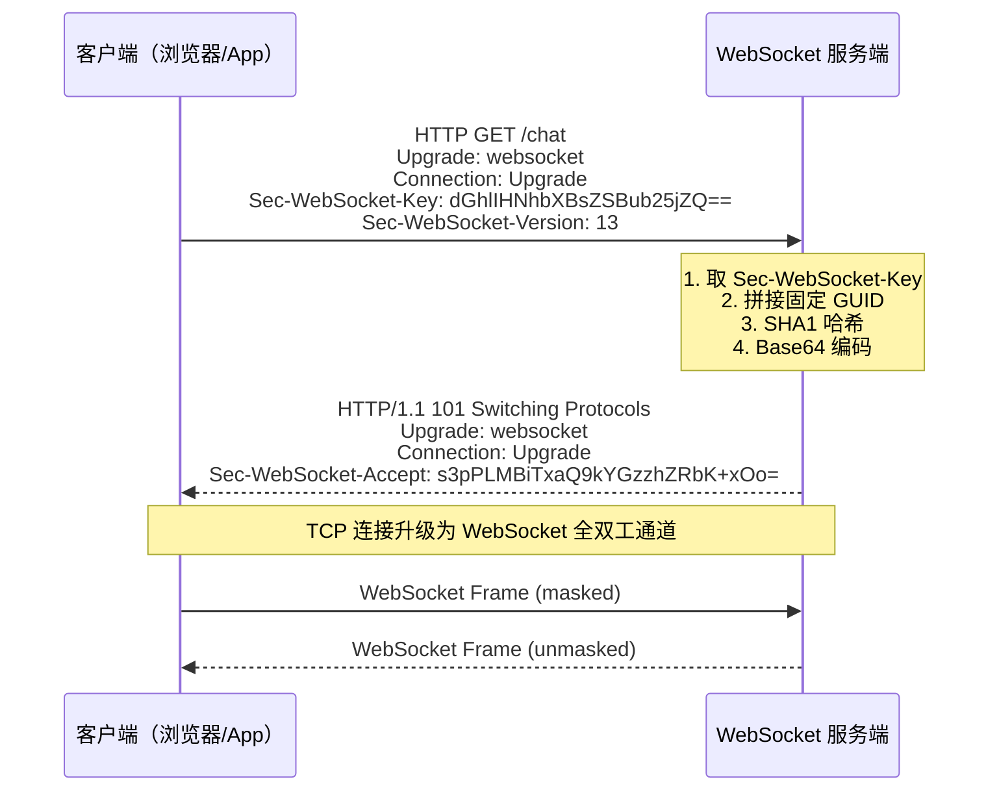

# WebSocket 协议原理与帧格式

> 对应 Java：[WebSocketCoreDemo.java](../../../java/base/websocket/WebSocketCoreDemo.java)

## 1. HTTP 升级到 WebSocket 握手流程



**Accept Key 计算公式：**

```
Sec-WebSocket-Accept = Base64( SHA1( Sec-WebSocket-Key + "258EAFA5-E914-47DA-95CA-C5AB0DC85B11" ) )
```

其中 `258EAFA5-E914-47DA-95CA-C5AB0DC85B11` 是 RFC 6455 规定的 Magic GUID。

---

## 2. WebSocket 帧格式二进制结构

参考 RFC 6455 Section 5.2：

```
 0                   1                   2                   3
 0 1 2 3 4 5 6 7 8 9 0 1 2 3 4 5 6 7 8 9 0 1 2 3 4 5 6 7 8 9 0 1
+-+-+-+-+-------+-+-------------+-------------------------------+
|F|R|R|R| opcode|M| Payload len |    Extended payload length    |
|I|S|S|S|  (4)  |A|     (7)     |             (16/64)           |
|N|V|V|V|       |S|             |   (if payload len==126/127)   |
| |1|2|3|       |K|             |                               |
+-+-+-+-+-------+-+-------------+ - - - - - - - - - - - - - - -+
|     Extended payload length continued, if payload len == 127  |
+ - - - - - - - - - - - - - - - +-------------------------------+
|                               |Masking-key, if MASK set to 1  |
+-------------------------------+-------------------------------+
| Masking-key (continued)       |          Payload Data         |
+-------------------------------- - - - - - - - - - - - - - - - +
:                     Payload Data continued ...                :
+ - - - - - - - - - - - - - - - - - - - - - - - - - - - - - - - +
|                     Payload Data continued ...                |
+---------------------------------------------------------------+
```

### 帧头字段详解

| 字段 | 位数 | 说明 |
|------|------|------|
| FIN | 1 bit | 是否为消息最后一帧。0=还有后续帧，1=最后一帧 |
| RSV1-3 | 3 bits | 保留位，扩展用（如压缩 permessage-deflate 用 RSV1） |
| Opcode | 4 bits | 帧类型 |
| MASK | 1 bit | 是否掩码。客户端→服务端必须为 1，服务端→客户端必须为 0 |
| Payload Length | 7 bits 或 7+16 或 7+64 | 载荷长度 |
| Masking-Key | 0 或 4 bytes | MASK=1 时有，4 字节随机值 |
| Payload Data | n bytes | 实际数据，客户端需要 XOR 解码 |

### Payload Length 三种编码

| 7位值 | 实际含义 | 扩展字节 | 最大长度 |
|-------|---------|---------|---------|
| 0-125 | 即长度本身 | 0 | 125 B |
| 126 | 后续 2 字节为长度 | 2 | 65535 B (64KB) |
| 127 | 后续 8 字节为长度 | 8 | 2^63-1 B |

---

## 3. Opcode 类型表

| Opcode | 名称 | 说明 |
|--------|------|------|
| 0x0 | Continuation | 延续帧，分片消息的后续帧 |
| 0x1 | Text | UTF-8 文本帧 |
| 0x2 | Binary | 二进制帧 |
| 0x3-0x7 | (保留) | 未来扩展用 |
| 0x8 | Connection Close | 关闭连接帧 |
| 0x9 | Ping | 心跳请求 |
| 0xA | Pong | 心跳响应 |
| 0xB-0xF | (保留) | 未来扩展用 |

---

## 4. 掩码（Mask）处理

- **客户端→服务端**：`MASK=1`，必须携带 4 字节 Masking-Key
- **服务端→客户端**：`MASK=0`，不允许掩码
- **解码算法**：`decoded_byte = encoded_byte XOR masking_key[i % 4]`

掩码的目的是防止缓存投毒攻击（Cache Poisoning）。因为 WebSocket 基于 HTTP 升级，中间代理可能缓存响应。通过掩码，客户端帧的 payload 对代理来说是不可预测的，避免了恶意构造 payload 被代理缓存。

---

## 5. 简易帧构造代码

```java
// 构造 Text 帧（服务端→客户端，不加掩码）
byte[] buildTextFrame(String message) {
    byte[] payload = message.getBytes(StandardCharsets.UTF_8);
    // FIN=1, Opcode=TEXT(0x1), MASK=0
    byte[] frame = new byte[2 + payload.length];
    frame[0] = (byte) (0x80 | 0x1);  // FIN + TEXT
    frame[1] = (byte) payload.length; // Len
    System.arraycopy(payload, 0, frame, 2, payload.length);
    return frame;
}
```