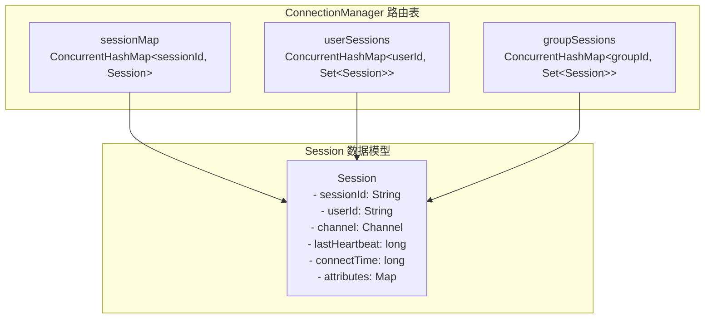
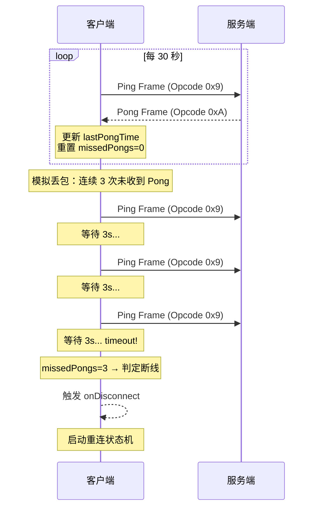
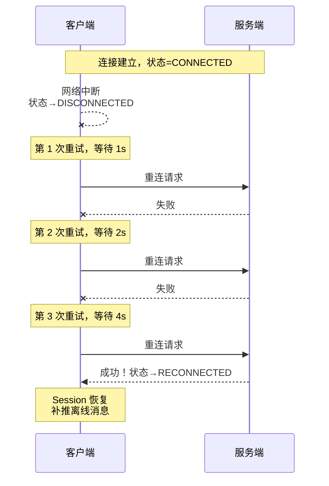

# 连接管理与心跳重连

> 对应 Java：[ConnectionManagerDemo.java](../../../java/base/websocket/ConnectionManagerDemo.java)、[HeartbeatDemo.java](../../../java/base/websocket/HeartbeatDemo.java)、[ReconnectDemo.java](../../../java/base/websocket/ReconnectDemo.java)

## 1. Session 路由表结构



### 路由操作复杂度

| 操作 | 数据结构 | 时间复杂度 |
|------|---------|-----------|
| 查找 Session by sessionId | sessionMap | O(1) |
| 查找用户所有 Session | userSessions | O(1) |
| 查找分组所有 Session | groupSessions | O(1) |
| sendToAll 广播 | sessionMap 遍历 | O(n) |
| sendToUser 单播 | userSessions.get + 遍历 | O(1+m) |
| sendToGroup 组播 | groupSessions.get + 遍历 | O(1+k) |

---

## 2. Ping/Pong 心跳时序图



### 服务端 IdleStateHandler 流程

| 空闲类型 | 阈值 | 触发动作 |
|---------|------|---------|
| readerIdle | 15s | 15 秒未收到数据 → 发送 Ping 探测客户端是否存活 |
| writerIdle | 30s | 30 秒未发送数据 → 发送 Pong 保活（或空帧） |
| allIdle | 60s | 60 秒无任何读写 → 判定死连接，直接关闭 |

Netty 配置示例：

```java
pipeline.addLast(new IdleStateHandler(15, 30, 60, TimeUnit.SECONDS));
pipeline.addLast(new HeartbeatHandler()); // 自定义处理器
```

---

## 3. 断线重连退避策略



### 指数退避序列

| 重试次数 | 等待时间 | 累计耗时 |
|---------|---------|---------|
| 1 | 1s | 1s |
| 2 | 2s | 3s |
| 3 | 4s | 7s |
| 4 | 8s | 15s |
| 5 | 16s | 31s |
| 6 | 30s (max) | 61s |

**Jitter 防惊群**：实际等待 = `baseInterval * (1 + random(-0.25, 0.25))`

---

## 4. 重连状态机

```
CONNECTED ──(网络断开)──▶ DISCONNECTED
                              │
                              ▼
                        RECONNECTING ──(成功)──▶ RECONNECTED ──▶ 正常通信
                              │
                              │ (失败，退避后重试)
                              └──▶ RECONNECTING (循环)
                              │
                              │ (超过最大重试次数)
                              ▼
                            FAILED ──▶ 通知用户/记录日志
```

---

## 5. Session 恢复流程

重连成功后需要恢复的上下文：

1. **sessionId 不变**：客户端重连时携带原有 sessionId
2. **userId 重新绑定**：服务端验证身份后，将新的 Channel 绑定到原有 userId
3. **attributes 恢复**：恢复之前的自定义属性（设备类型、登录IP等）
4. **分组恢复**：重新加入之前的群组
5. **离线消息补推**：拉取积压队列，按序推送

---

## 6. 连接生命周期完整流程

```
onConnect → 创建 Session → 加入 sessionMap
    ↓
bindUser  → 加入 userSessions 路由表
    ↓
joinGroup → 加入 groupSessions 路由表
    ↓
onMessage → 更新 lastHeartbeat + 业务处理
    ↓ (循环)
    ...
    ↓
onClose   → 清理路由表 + 通知离线 + 关闭 Channel
    或
onError   → 同 onClose
```