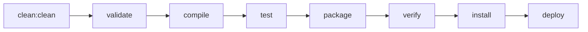
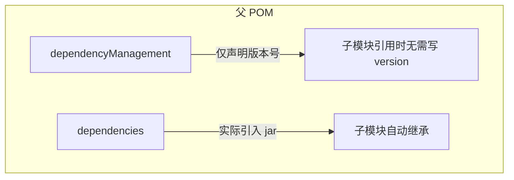
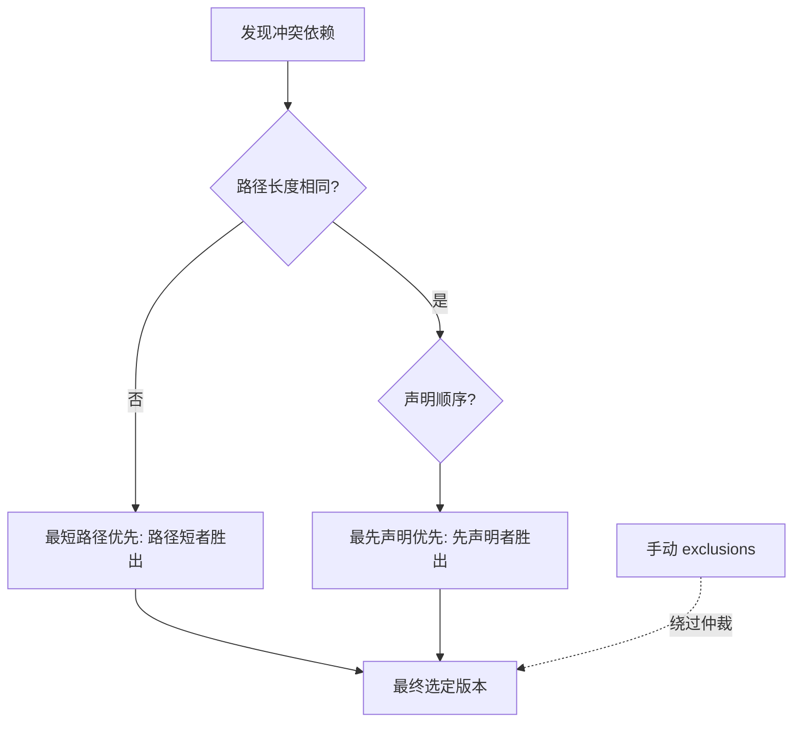
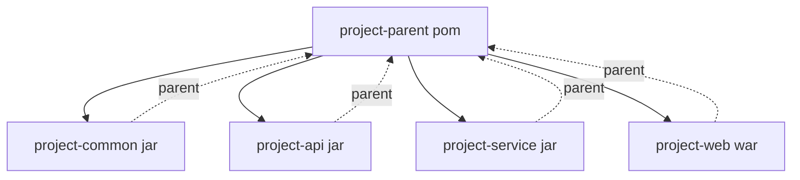

# 01-Maven 核心概念

## Maven 生命周期 (Lifecycle)

三个内置生命周期: **clean** / **default** / **site**

| Phase | 插件 Goal | 说明 |
|-------|-----------|------|
| clean | maven-clean-plugin:clean | 删除 target/ |
| compile | maven-compiler-plugin:compile | 编译 src/main/java |
| test | maven-surefire-plugin:test | 运行 src/test/java |
| package | maven-jar-plugin:jar | 打包 jar/war |
| install | maven-install-plugin:install | 安装到 ~/.m2 |
| deploy | maven-deploy-plugin:deploy | 发布远程仓库 |

---

## dependencyManagement vs dependencies

**关键区别:** dependencyManagement 只声明版本, 不实际引入; dependencies 实际下载 jar 并传递给子模块.

---

## Scope 依赖范围

| Scope | 编译 | 测试 | 运行 | 传递 | 典型依赖 |
|-------|:--:|:--:|:--:|:--:|---------|
| compile(默认) | O | O | O | O | spring-boot-starter |
| provided | O | O | X | X | servlet-api, lombok |
| runtime | X | O | O | O | mysql-connector-java |
| test | X | O | X | X | junit, mockito |

---

## 依赖冲突解决 (Maven 仲裁)

**三原则:**
1. **最短路径优先** -- 依赖树中层级浅的胜出
2. **最先声明优先** -- 路径长度相同时, POM 中先声明的胜出
3. **exclusions** -- 手动排除, 优先级最高

---

## 多模块聚合 (pom packaging)

**聚合:** 父模块通过 `<modules>` 知道有哪些子模块
**继承:** 子模块通过 `<parent>` 知道父模块是谁
**两者方向相反, 通常同时使用**

---

## 常用 Maven 命令速查

| 命令 | 用途 |
|------|------|
| `mvn clean` | 清理 target |
| `mvn compile` | 编译源码 |
| `mvn test` | 运行单元测试 |
| `mvn package -DskipTests` | 打包跳过测试 |
| `mvn install` | 安装到本地仓库 |
| `mvn deploy` | 发布到远程仓库 |
| `mvn dependency:tree` | 查看依赖树 |
| `mvn help:effective-pom` | 查看最终生效 POM |
| `mvn -U clean install` | 强制更新 SNAPSHOT |
| `mvn -T 4 clean install` | 4 线程并行构建 |