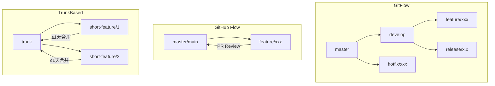
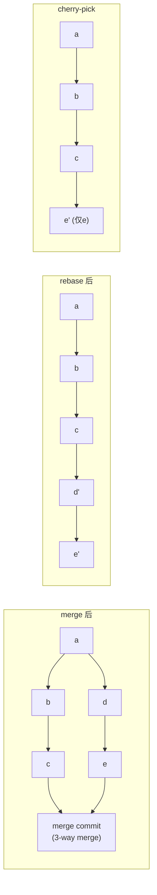
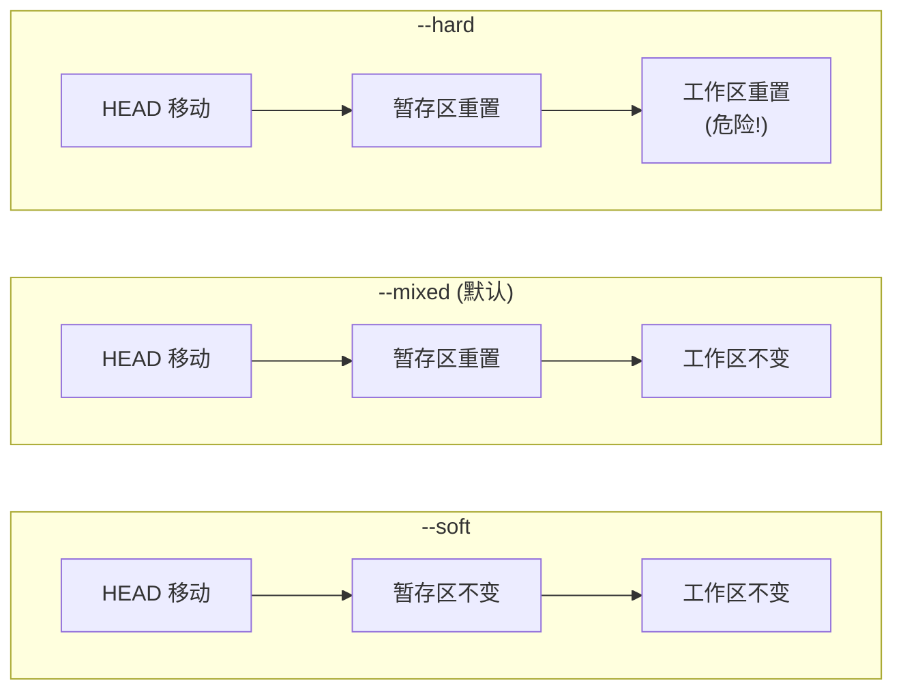
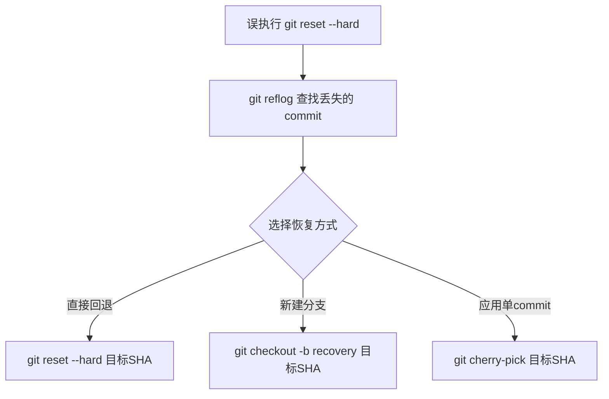

# 02-Git 分支与合并策略

## 三大工作流对比



| 策略 | 分支数量 | 适合场景 |
|------|---------|---------|
| GitFlow | 多 (master+develop+feature+release+hotfix) | 固定发版周期, 移动端/客户端 |
| GitHub Flow | 少 (master + feature) | SaaS/Web 持续部署 |
| TrunkBased | 极少 (trunk + 短分支) | CI/CD 成熟, 大型团队 |

---

## merge vs rebase vs cherry-pick



| 操作 | 历史结果 | 黄金法则 |
|------|---------|---------|
| merge | 网状历史, 保留 merge commit | 公共分支用 merge |
| rebase | 线性历史, commit 被重写 | 推送过的分支严禁 rebase |
| cherry-pick | 复制单个 commit 到当前分支 | 跨分支迁移单个修复 |

---

## 冲突标记格式

```
<<<<<<< HEAD                    ← 当前分支 (ours)
public String getName() {
    return "Alice";            ← 我们的修改
}
=======                         ← 分隔线
public String getName() {
    return "Bob";              ← 合并分支的修改
}
>>>>>>> feature/user-manage    ← 合并源分支名
```

**解决方式:**
1. 手动编辑删除标记, 保留正确内容
2. `git checkout --ours file` -- 全用当前分支版本
3. `git checkout --theirs file` -- 全用合并分支版本
4. IDE 可视化合并工具 (VSCode/IDEA)

---

## reset 三种模式



| 模式 | HEAD | 暂存区 | 工作区 | 用途 |
|------|:--:|:--:|:--:|------|
| --soft | 移 | 不变 | 不变 | 撤销 commit, 保留修改重新提交 |
| --mixed | 移 | 重置 | 不变 | 撤销 commit+add, 修改回工作区 |
| --hard | 移 | 重置 | 重置 | 完全丢弃 (危险!) |

---

## reflog 误删恢复流程



---

## 常用 Git 命令

| 命令 | 用途 |
|------|------|
| `git log --oneline --graph --all` | 可视化分支历史 |
| `git stash / git stash pop` | 暂存/恢复工作区 |
| `git rebase -i HEAD~3` | 交互式 rebase 合并最近 3 个 commit |
| `git cherry-pick abc123..def456` | 批量 cherry-pick |
| `git revert abc123` | 撤销某个 commit (生成新 commit) |
| `git reflog` | 查看 HEAD 变更历史 |
| `git bisect start / good / bad` | 二分法定位 bug 引入的 commit |