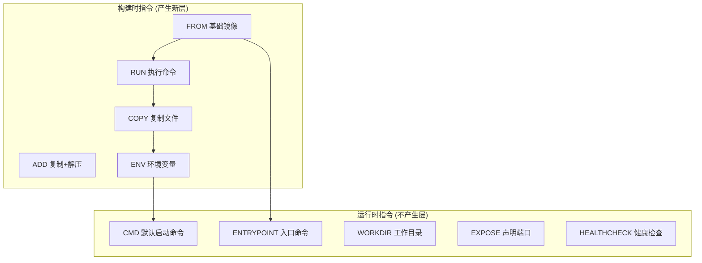
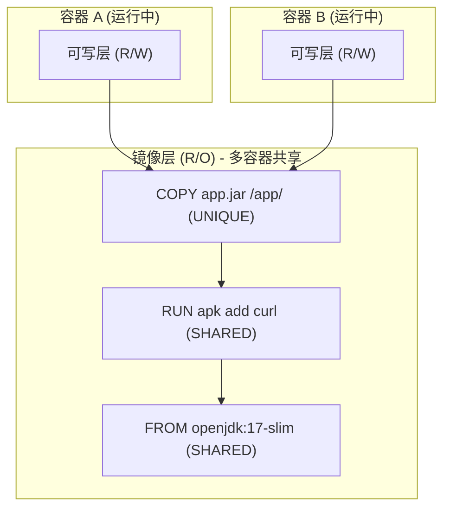
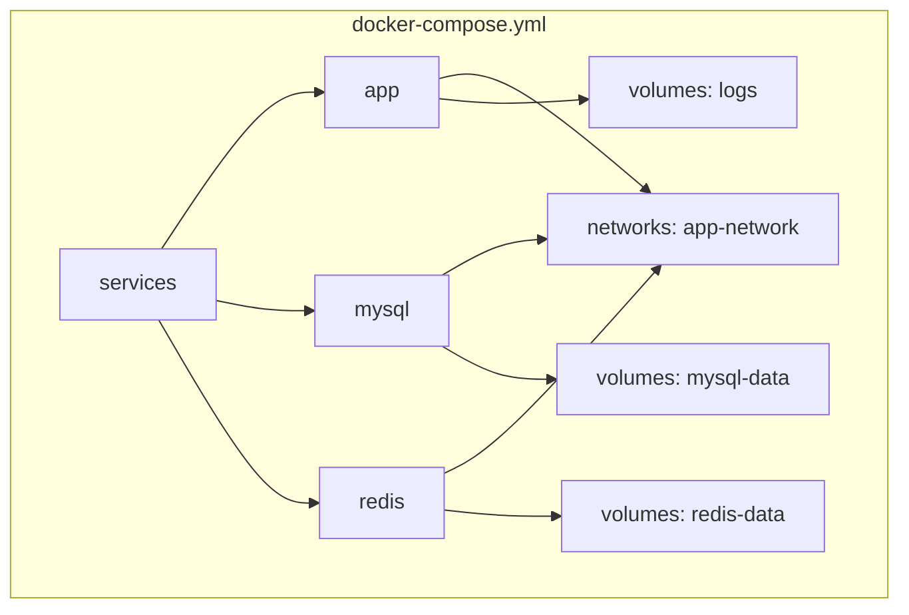

# 03-Docker 与容器编排

## Dockerfile 核心指令



| 指令 | 产生新层? | 说明 |
|------|:--:|------|
| FROM | 否(基础) | 指定基础镜像, 必须是第一条指令 |
| RUN | 是 | 构建时执行 shell 命令 |
| COPY | 是 | 从构建上下文复制文件 (推荐) |
| ADD | 是 | COPY + 自动解压 tar + URL (慎用) |
| CMD | 否 | 容器启动默认命令, 可被覆盖 |
| ENTRYPOINT | 否 | 容器入口命令, 参数追加 |
| EXPOSE | 否 | 声明端口, 仅文档作用 |
| HEALTHCHECK | 否 | 容器健康检查命令 |

---

## CMD vs ENTRYPOINT 组合模式 (最佳实践)

```dockerfile
# ENTRYPOINT 固定执行程序, CMD 提供默认参数
ENTRYPOINT ["java", "-jar", "app.jar"]
CMD ["--server.port=8080"]

# docker run myimg                           → java -jar app.jar --server.port=8080
# docker run myimg --server.port=9090        → java -jar app.jar --server.port=9090
```

---

## 镜像分层 (Overlay2 copy-on-write)



**copy-on-write 原理:**
1. 多个容器共享镜像的所有只读层
2. 容器需要写入时, 将文件从下层 copy 到顶层可写层, 在顶层修改
3. 原始下层文件保持不变, 其他容器不受影响
4. 好处: 节省磁盘空间 + 加速容器启动 (层缓存)

---

## Docker 网络模式

| 模式 | 与宿主机隔离 | 跨容器互通 | 典型场景 |
|------|:--:|:--:|---------|
| bridge (默认) | 是 (NAT) | 同一 bridge 网络 | docker0 网桥 |
| host | 否 (共用网络栈) | -- | 高性能网络 |
| none | 完全隔离 | 否 | 批处理容器 |
| overlay | 是 (VXLAN) | 跨主机多容器 | Swarm 集群 |

**Port mapping 格式:**
```
-p 8080:8080           ← 宿主机:容器 端口映射
-p 127.0.0.1:8080:8080 ← 仅绑定本地回环
-p 8080-8090:8080-8090 ← 端口范围映射
-P                      ← 映射所有 EXPOSE 端口
```

---

## docker-compose.yml 核心结构



关键字段: `services` / `networks` / `volumes` / `ports` / `environment` / `depends_on`

---

## 常用 Docker 命令

| 命令 | 用途 |
|------|------|
| `docker build -t myapp:1.0 .` | 构建镜像 |
| `docker run -d -p 8080:8080 --name app myapp:1.0` | 启动容器 |
| `docker ps / docker ps -a` | 查看运行/全部容器 |
| `docker logs -f app` | 实时查看日志 |
| `docker exec -it app sh` | 进入容器 shell |
| `docker stats` | 资源使用统计 |
| `docker-compose up -d` | 后台启动所有服务 |
| `docker-compose down` | 停止并删除资源 |