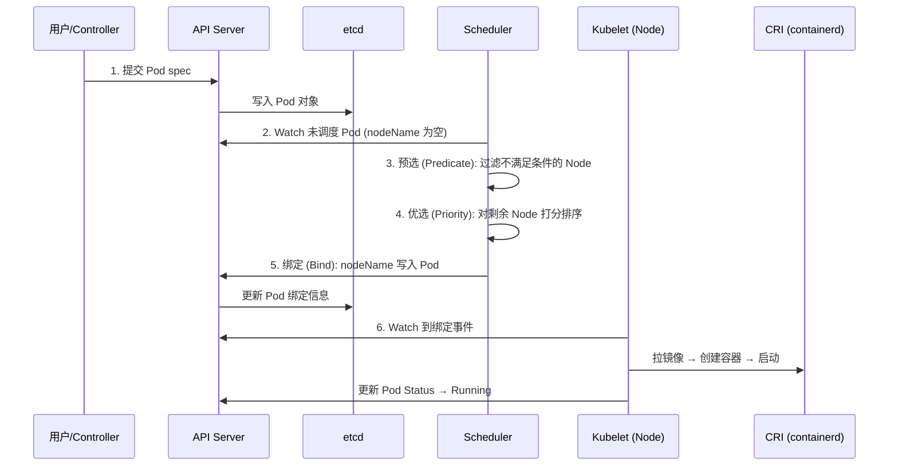
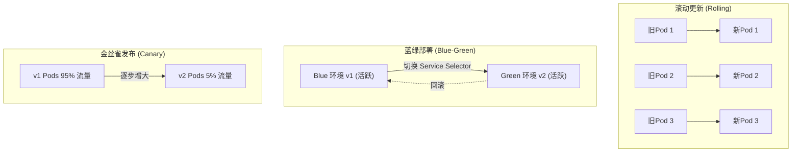
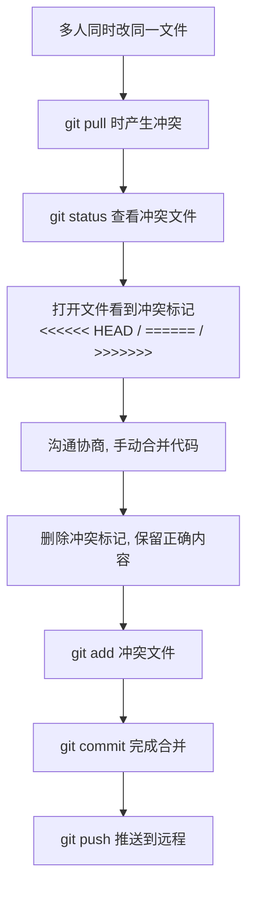

# 04-面试高频问题

## Q1: K8s 调度流程 (Pod 创建到运行 6 步)



**预选阶段常见过滤条件:** 资源不足 / 污点(Taint) / 端口冲突 / NodeSelector 不匹配 / Node Condition (MemoryPressure/DiskPressure)

**优选阶段常见打分策略:** LeastRequestedPriority (资源空闲多分高) / BalancedResourceAllocation (CPU/内存均衡) / ImageLocality (已有镜像分高)

---

## Q2: 滚动更新 vs 蓝绿部署 vs 金丝雀发布



| 策略 | 资源消耗 | 回滚速度 | 流量控制 | 适合场景 |
|------|:--:|:--:|:--:|---------|
| 滚动更新 | 低 | 逐步 | 无 (按 Pod 比例) | 常规业务更新 |
| 蓝绿部署 | 高 (双倍) | 秒级 | 无 (全量切换) | 重大版本, 快速回滚 |
| 金丝雀发布 | 中 | 秒级 | 精确 (header/cookie/权重) | A/B 测试, 灰度验证 |

---

## Q3: Dockerfile 最佳实践 6 条

1. **多阶段构建** -- 分离编译/运行环境, 镜像从 500MB -> 150MB
2. **最小化层数** -- 合并 RUN 命令, 清理缓存 (`rm -rf /var/lib/apt/lists/*`)
3. **.dockerignore** -- 排除 target/ .git/ *.md, 减小构建上下文
4. **最小基础镜像** -- alpine/slim/distroless, 减少攻击面
5. **非 root 用户** -- USER appuser, 安全最佳实践
6. **HEALTHCHECK** -- 配合 K8s liveness/readiness probe

---

## Q4: Git 多人协作解决冲突流程



**减少冲突的团队规范:**
1. 小步提交, 频繁合并 -- 每天向 develop 合并
2. 模块化拆分 -- 不同功能不同包/文件
3. 提前同步 -- `git pull --rebase origin develop`
4. 明确分工 -- 同文件修改提前沟通

---

## Q5: Linux 一条命令查 CPU 占用前 10

```bash
ps aux --sort=-%cpu | head -11
```

- `ps aux` -- 列出所有进程详细信息
- `--sort=-%cpu` -- 按 CPU 使用率降序 (减号 = 降序)
- `head -11` -- 取前 11 行 (1 行表头 + 10 行数据)

**替代命令:**
- `top -b -n 1 | head -17` -- top 批处理模式
- `pidstat 1` -- 持续监控 CPU (sysstat 包)
- `htop` -- 交互式彩色 top

---

## Q6: Linux 磁盘满了排查流程

```mermaid
flowchart TD
    A[df -h 发现磁盘使用率高] --> B[du -sh /* | sort -rh | head -10<br/>定位大目录]
    B --> C{大目录类型?}
    C -->|"日志文件"| D[logrotate 轮转 / journalctl --vacuum-size]
    C -->|"Docker"| E[docker system prune -a]
    C -->|"临时文件"| F[清理 /tmp, find -mtime +N -delete]
    C -->|"已删除未释放"| G[lsof | grep deleted → 重启进程]
    C -->|"应用数据"| H[归档/迁移/扩容]
```

---

## Q7: HPA 自动扩缩容公式

```
期望副本数 = ceil(当前副本数 × 当前CPU使用率 / 目标CPU使用率)
```

**示例:** 2 副本, CPU 85%, 目标 60%
`ceil(2 × 85 / 60) = ceil(2.83) = 3` → 扩容到 3 副本

HPA 命令:
- `kubectl autoscale deployment myapp --min=2 --max=10 --cpu-percent=60`
- `kubectl get hpa`
- `kubectl describe hpa myapp`