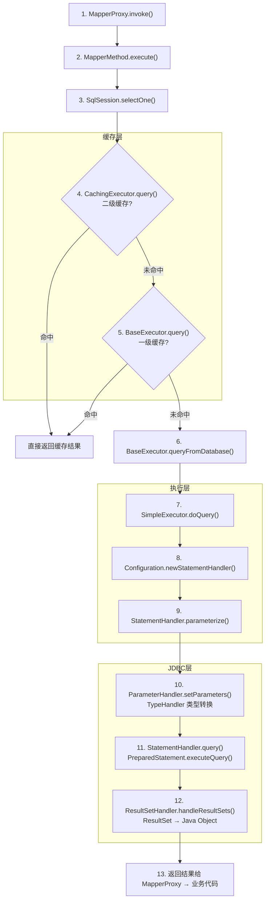
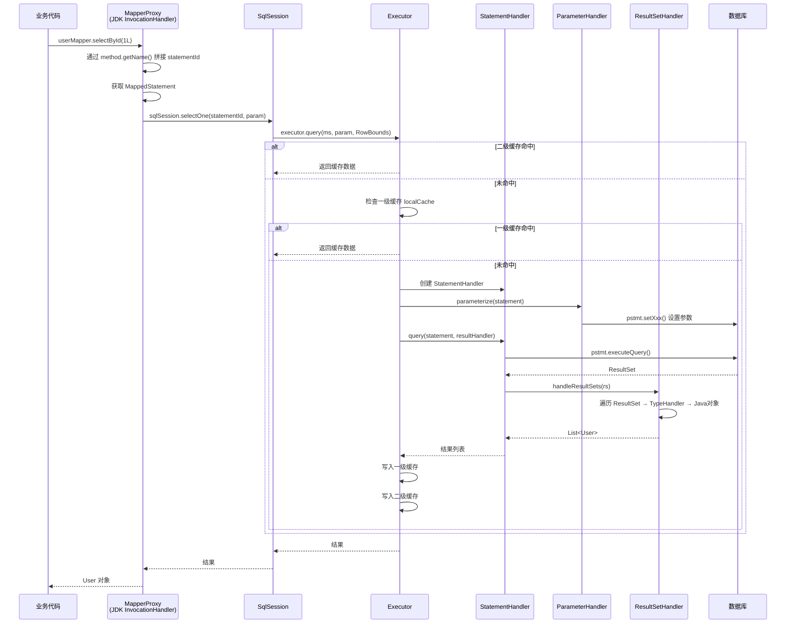
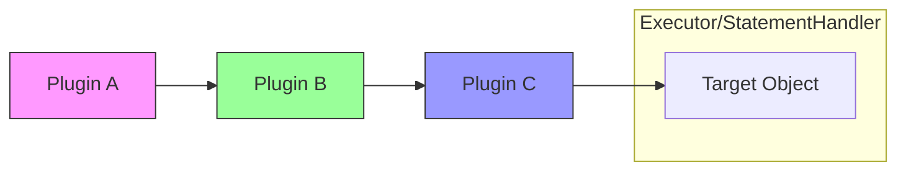
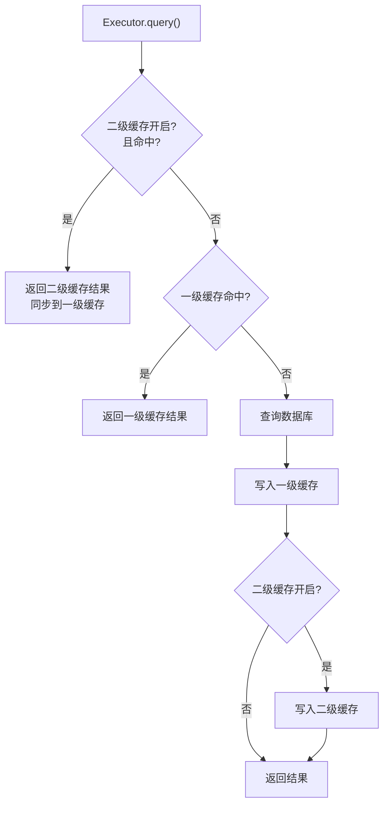

# MyBatis 核心流程源码分析

## 1. 完整 13 步调用链流程图



## 2. MapperProxy JDK 代理时序图



## 3. 拦截器链（责任链模式）



### 拦截器链包装过程

```java
// 原始目标
StatementHandler handler = new PreparedStatementHandler(...);

// 插件链包装（责任链模式）
// Configuration.interceptorChain.pluginAll(handler)
for (Interceptor interceptor : interceptors) {
    handler = (StatementHandler) interceptor.plugin(handler);
}
// handler 现在是: PluginC → PluginB → PluginA → PreparedStatementHandler
```

### Plugin.wrap() JDK 动态代理

```
Plugin implements InvocationHandler {
    Object target;         // 被包装的真实对象
    Interceptor interceptor; // 关联的拦截器

    invoke(proxy, method, args) {
        // 仅拦截 @Signature 指定的方法
        if (method matches @Signature) {
            return interceptor.intercept(new Invocation(target, method, args));
        }
        return method.invoke(target, args);
    }
}
```

## 4. 缓存查询策略流程图



## 5. 核心源码类关系

| 类 | 包路径 | 职责 |
|----|--------|------|
| SqlSessionFactoryBuilder | org.apache.ibatis.session | 构建 SqlSessionFactory |
| SqlSessionFactory | org.apache.ibatis.session | 创建 SqlSession |
| SqlSession | org.apache.ibatis.session | 门面 API |
| MapperProxy | org.apache.ibatis.binding | JDK 动态代理 |
| MapperMethod | org.apache.ibatis.binding | 方法路由 |
| BaseExecutor | org.apache.ibatis.executor | 模板方法，一级缓存 |
| CachingExecutor | org.apache.ibatis.executor | 装饰器，二级缓存 |
| SimpleExecutor | org.apache.ibatis.executor | 默认 Executor |
| RoutingStatementHandler | org.apache.ibatis.executor.statement | 路由到具体 Handler |
| PreparedStatementHandler | org.apache.ibatis.executor.statement | PreparedStatement 处理 |
| DefaultParameterHandler | org.apache.ibatis.scripting.defaults | 参数设置 |
| DefaultResultSetHandler | org.apache.ibatis.executor.resultset | 结果集映射 |
| InterceptorChain | org.apache.ibatis.plugin | 插件责任链 |
| Plugin | org.apache.ibatis.plugin | JDK 动态代理包装 |