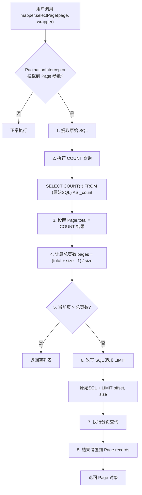
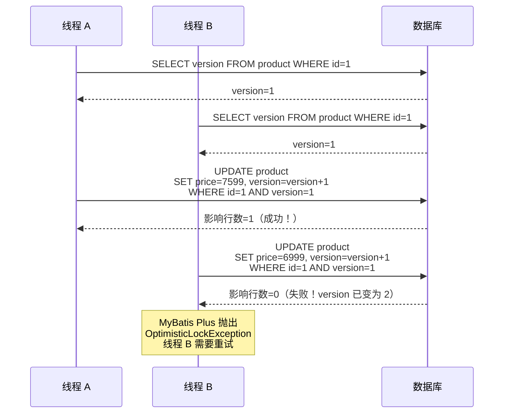
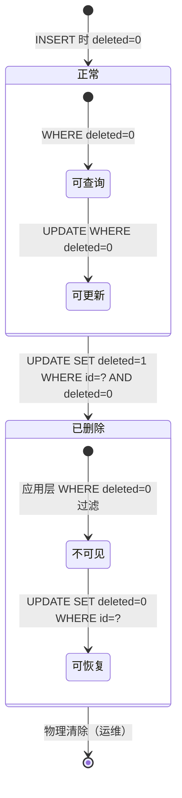

# MyBatis Plus 实战

## 1. 分页插件 SQL 改写流程



### 不同数据库方言的 LIMIT

| 数据库 | LIMIT 语法 | 示例（第2页，每页10条） |
|--------|------------|------------------------|
| MySQL | `LIMIT offset, size` | `LIMIT 10, 10` |
| PostgreSQL | `LIMIT size OFFSET offset` | `LIMIT 10 OFFSET 10` |
| Oracle 12c+ | `OFFSET offset ROWS FETCH NEXT size ROWS ONLY` | `OFFSET 10 ROWS FETCH NEXT 10 ROWS ONLY` |
| SQL Server 2012+ | `OFFSET offset ROWS FETCH NEXT size ROWS ONLY` | `OFFSET 10 ROWS FETCH NEXT 10 ROWS ONLY` |

## 2. 乐观锁 CAS 更新流程



### 乐观锁核心 SQL

```sql
-- MyBatis Plus 自动生成（@Version 注解标注 version 字段）
UPDATE t_product
SET name = #{name},
    price = #{price},
    version = version + 1    -- 版本号自增
WHERE id = #{id}
  AND version = #{version}  -- CAS 条件：版本号必须匹配
```

## 3. 逻辑删除状态图



### 逻辑删除 SQL 改写原理

```
原始 DELETE:
  DELETE FROM t_product WHERE id = #{id}

MyBatis Plus 改写为:
  UPDATE t_product SET deleted = 1 WHERE id = #{id} AND deleted = 0

原始 SELECT:
  SELECT * FROM t_product

MyBatis Plus 改写为:
  SELECT * FROM t_product WHERE deleted = 0
```

## 4. BaseMapper 核心方法

| 方法 | 说明 | 对应 SQL |
|------|------|----------|
| `insert(T entity)` | 插入一条记录 | `INSERT INTO table(...) VALUES(...)` |
| `deleteById(Serializable id)` | 根据 ID 删除 | `DELETE FROM table WHERE id=?` (或逻辑删除改写) |
| `updateById(T entity)` | 根据 ID 更新 | `UPDATE table SET ... WHERE id=?` |
| `selectById(Serializable id)` | 根据 ID 查询 | `SELECT ... FROM table WHERE id=?` |
| `selectList(Wrapper<T> wrapper)` | 条件查询列表 | `SELECT ... FROM table WHERE ...` |
| `selectPage(Page<T> page, Wrapper<T> wrapper)` | 分页查询 | `SELECT ... FROM table WHERE ... LIMIT ?,?` |

## 5. MyBatis Plus 核心注解

| 注解 | 作用 | 示例 |
|------|------|------|
| `@TableName("t_user")` | 指定表名 | `@TableName("t_user")` |
| `@TableId(type = IdType.AUTO)` | 主键策略 | `@TableId(type = IdType.ASSIGN_ID)` 雪花算法 |
| `@TableField("user_name")` | 字段映射（驼峰自动） | `@TableField(fill = FieldFill.INSERT)` |
| `@Version` | 乐观锁版本号 | `private Integer version;` |
| `@TableLogic` | 逻辑删除 | `private Integer deleted;` |
| `@EnumValue` | 枚举值映射 | `@EnumValue private int code;` |

## 6. 项目引入依赖

```xml
<dependency>
    <groupId>com.baomidou</groupId>
    <artifactId>mybatis-plus-boot-starter</artifactId>
    <version>3.5.5</version>
</dependency>

<!-- 代码生成器 -->
<dependency>
    <groupId>com.baomidou</groupId>
    <artifactId>mybatis-plus-generator</artifactId>
    <version>3.5.5</version>
</dependency>

<!-- 分页插件需要 -->
@Configuration
public class MybatisPlusConfig {
    @Bean
    public MybatisPlusInterceptor mybatisPlusInterceptor() {
        MybatisPlusInterceptor interceptor = new MybatisPlusInterceptor();
        interceptor.addInnerInterceptor(new PaginationInnerInterceptor(DbType.MYSQL));
        interceptor.addInnerInterceptor(new OptimisticLockerInnerInterceptor());
        return interceptor;
    }
}
```