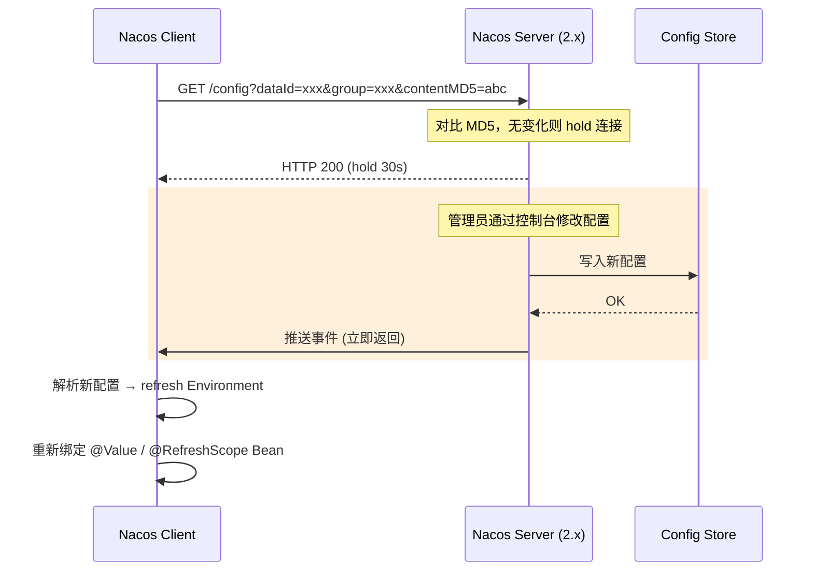
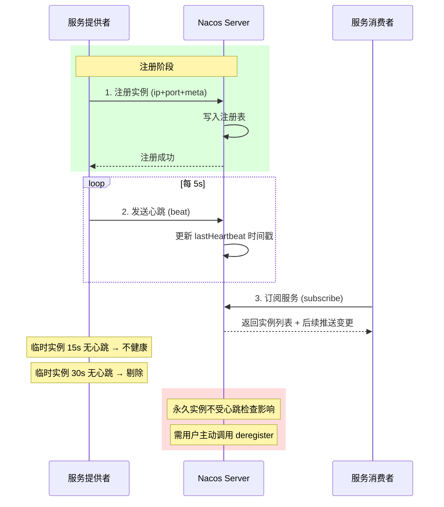
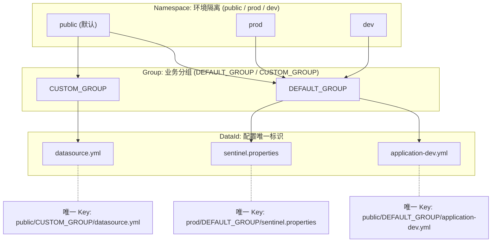

# Nacos 配置中心与服务发现

> 对应 Java Demo：[NacosConfigDemo.java](../../../java/base/spring/alibaba/NacosConfigDemo.java) [NacosDiscoveryDemo.java](../../../java/base/spring/alibaba/NacosDiscoveryDemo.java)

---

## 一、配置长轮询时序图



**关键机制**：
- Nacos 1.x：HTTP 短轮询，客户端每 30s 拉取一次
- Nacos 2.x：gRPC 长连接（基于 HTTP/2），服务端主动推送变更，性能提升 **10 倍**
- MD5 对比：客户端携带 `contentMD5`，服务端对比后决定是否返回新内容

---

## 二、服务注册心跳图



**临时实例 vs 永久实例**：

| 维度 | 临时实例 (ephemeral) | 永久实例 (persistent) |
|------|---------------------|----------------------|
| CAP | AP (Distro 协议) | CP (Raft 协议) |
| 心跳 | 必需 (5s 间隔) | 不需要 |
| 剔除 | 自动 (15s 不健康, 30s 剔除) | 手动注销 |
| 场景 | 微服务 (K8s Pod) | DNS / CoreDNS |

---

## 三、Namespace / Group / DataId 三级定位图



**DataId 命名规则**：
```
${prefix}-${spring.profiles.active}.${file-extension}

示例：
  application-dev.yml
  application-prod.properties
  user-service-dev.yml
```

---

## 四、配置优先级链

```
1. 命令行参数          --server.port=9090         (最高优先级)
2. 环境变量             SERVER_PORT=9090
3. Nacos 配置中心       DataId=application-dev.yml
4. application.yml      classpath 配置文件
5. bootstrap.yml        (Spring Cloud 2020 起已移除)
```

**优先级规则**：外部化配置 > 内部配置，远程 > 本地，精确 > 模糊。