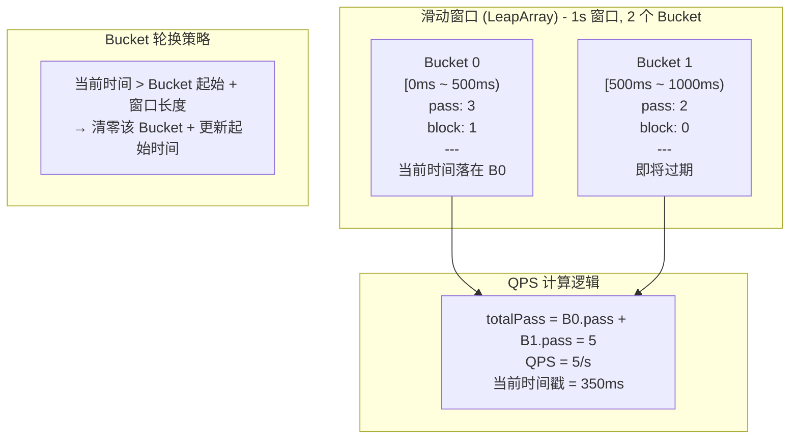
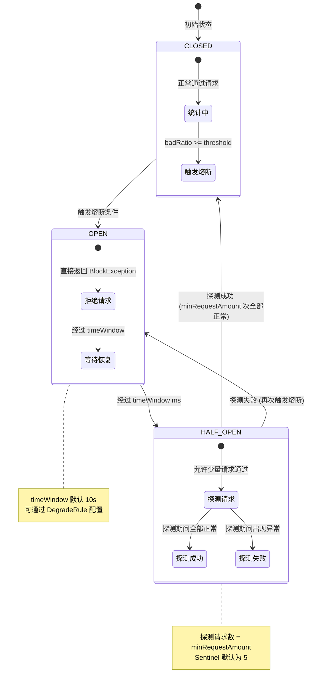
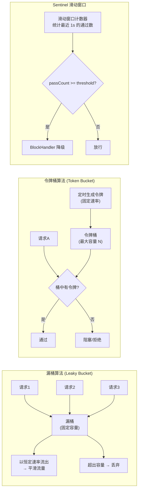

# Sentinel 流控与熔断降级

> 对应 Java Demo：[SentinelDemo.java](../../../java/base/spring/alibaba/SentinelDemo.java)

---

## 一、滑动窗口结构图

**核心要点**：
- 每个 Bucket 独立统计 `pass` / `block` / `complete` / `error` / `rt`
- 滑动窗口随时间推移不断轮换过期的 Bucket
- N Bucket 覆盖 N * bucketSizeMs 的时间范围
- QPS = 当前窗口内所有有效 Bucket 的 pass 之和

---

## 二、熔断状态流转图

---

## 三、限流算法对比

| 算法 | 流量整形 | 突发处理 | Sentinel 使用场景 |
|------|---------|---------|------------------|
| 漏桶 | 恒定速率流出 | 不允许突发 | WarmUp 预热模式 |
| 令牌桶 | 允许突发 (桶中积累) | 允许 | 排队等待模式 |
| 滑动窗口 | 固定窗口内计数 | 不允许 | 默认 QPS 限流 |

---

## 四、blockHandler vs fallback 区别

| 维度 | blockHandler | fallback |
|------|-------------|----------|
| 触发条件 | 限流/熔断 (BlockException) | 业务异常 (任意 Throwable) |
| 参数要求 | 必须包含 BlockException | 必须包含 Throwable (可选) |
| 是否统计 | 被限流的请求不计入熔断统计 | 异常请求计入熔断统计 |
| 优先级 | 先于 fallback 执行 | 后于 blockHandler 执行 |
| 配置示例 | `@SentinelResource(blockHandler="xxx")` | `@SentinelResource(fallback="xxx")` |

**同时配置时的执行顺序**：
1. 先检查限流/熔断规则 --> 触发 `blockHandler`
2. 通过规则检查 --> 执行业务方法
3. 业务方法抛异常 --> 触发 `fallback`