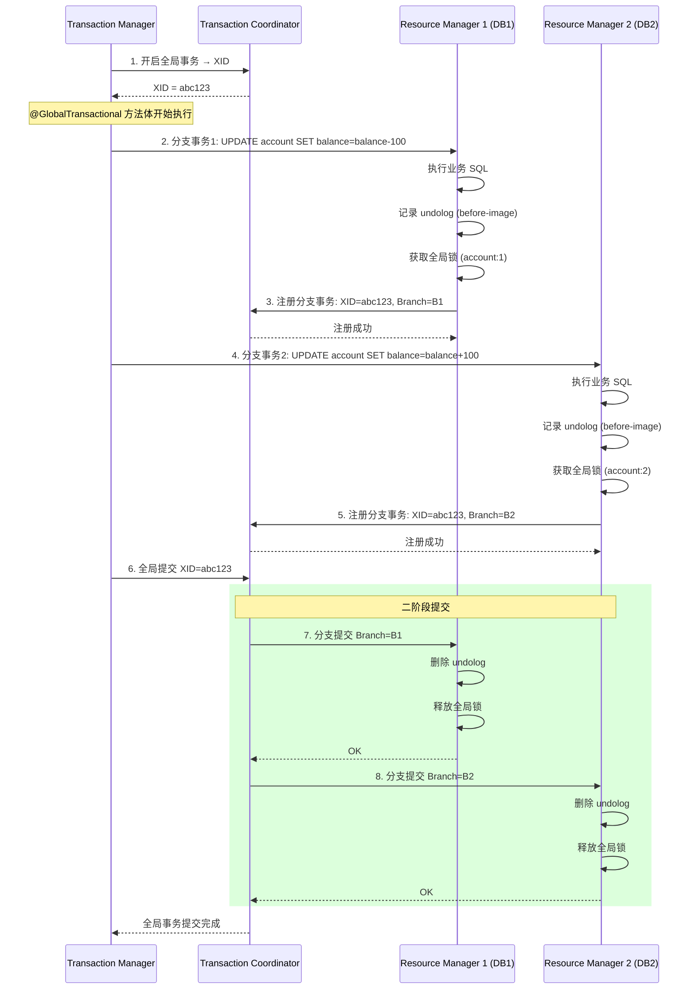
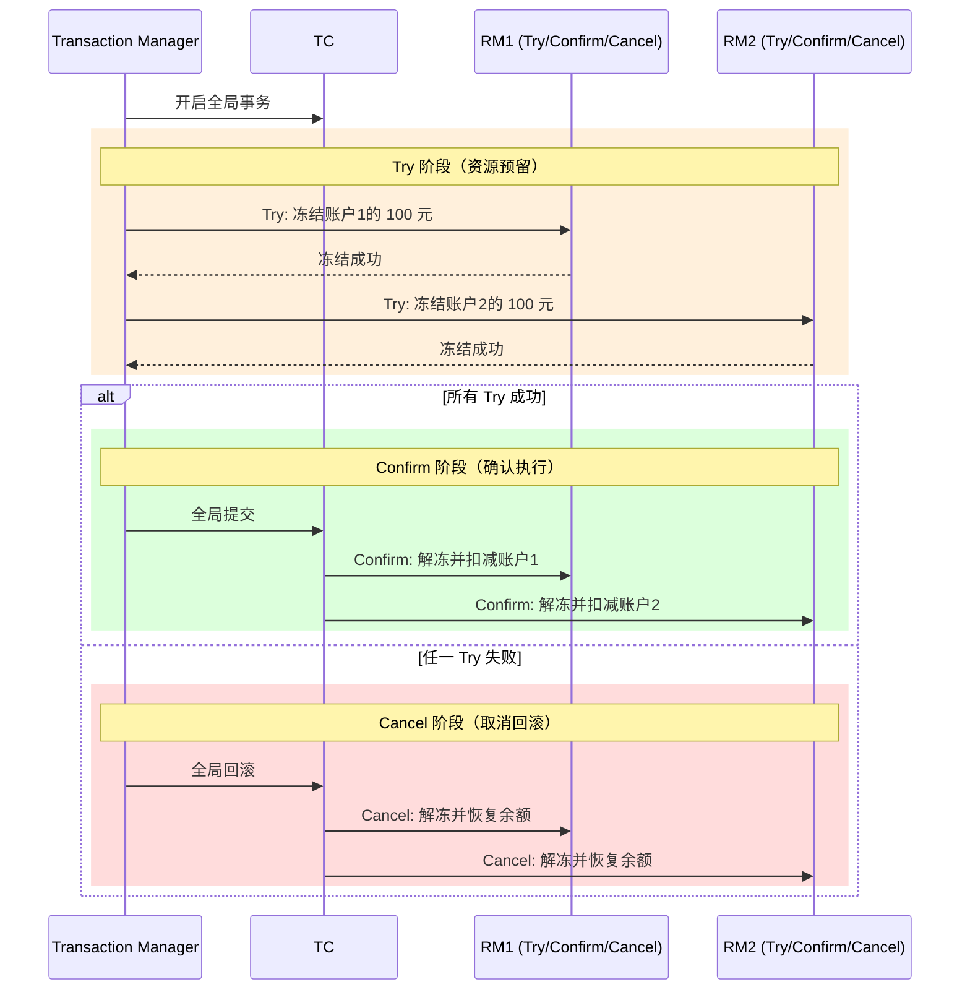
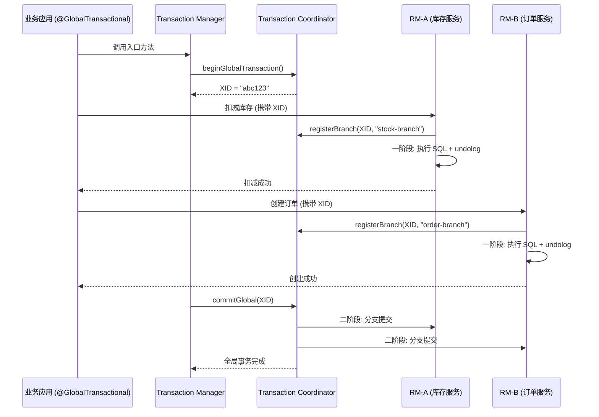

# Seata 分布式事务

> 对应 Java Demo：[SeataDemo.java](../../../java/base/spring/alibaba/SeataDemo.java)

---

## 一、AT 模式 undolog 提交时序图

**undolog 内容**：
- `beforeImage`：修改前的行数据（用于回滚还原）
- `afterImage`：修改后的行数据（用于回滚时校验，防止脏写）

**全局锁的作用**：在 AT 模式一阶段到二阶段之间，防止其他事务修改同一行数据。

---

## 二、TCC 三阶段图

**TCC 三阶段职责**：

| 阶段 | 职责 | 示例（转账） |
|------|------|------------|
| Try | 资源预留/锁定 | 冻结 A 账户 100 元 |
| Confirm | 确认执行 | 扣减 A 账户，增加 B 账户 |
| Cancel | 取消回滚 | 解冻 A 账户 100 元 |

**空回滚**：Try 未执行（网络超时等），TC 发起 Cancel，RM 发现无 Try 记录，直接返回成功。

**悬挂**：Cancel 先于 Try 到达，RM 需要记录 Cancel 操作，拒绝后续到达的 Try。

---

## 三、TC/TM/RM 交互时序图

---

## 四、四种模式对比

| 维度 | AT | TCC | Saga | XA |
|------|-----|-----|------|-----|
| **侵入性** | 无（自动代理） | 高（三接口） | 中（补偿接口） | 无（自动） |
| **一致性** | 最终一致 | 最终一致 | 最终一致 | 强一致（2PC） |
| **性能** | 高 | 高 | 高 | 低（锁资源） |
| **回滚方式** | undolog 自动 | Cancel 手动 | 补偿正向操作 | 自动 |
| **适用场景** | 通用 CRUD | 金额/库存/积分 | 长事务 (>10s) | 传统事务数据库 |
| **全局锁** | 有（防脏写） | 无 | 无 | 数据库行锁 |
| **空回滚处理** | 自动 | 需自行处理 | 需自行处理 | 自动 |

> 推荐顺序：AT > TCC > Saga > XA（AT 优先，侵入性最低，90% 场景满足需求）