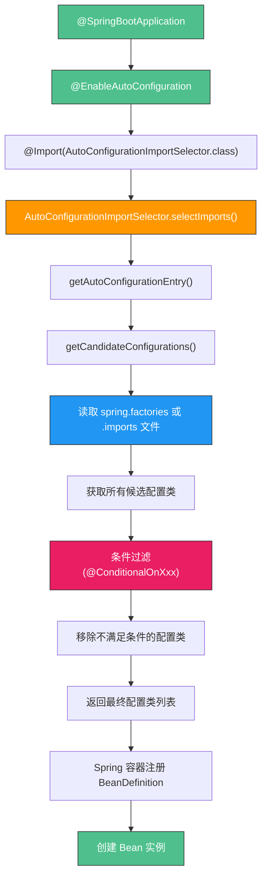

# Spring Boot 自动配置原理

## 一、核心链路总览



## 二、@SpringBootApplication 拆解

`@SpringBootApplication` 是一个组合注解，等价于以下三个注解的组合：

| 注解 | 作用 |
|------|------|
| `@SpringBootConfiguration` | 标记该类为配置类（本质是 `@Configuration`） |
| `@EnableAutoConfiguration` | 触发自动配置机制 |
| `@ComponentScan` | 扫描当前包及子包中的组件 |

```java
// @SpringBootApplication 简化等价写法
@SpringBootConfiguration
@EnableAutoConfiguration
@ComponentScan
public class MyApplication {
    public static void main(String[] args) {
        SpringApplication.run(MyApplication.class, args);
    }
}
```

## 三、AutoConfigurationImportSelector 源码链路

### selectImports 调用链（Spring Boot 3.x）

```
selectImports(AnnotationMetadata)
  → getAutoConfigurationEntry(AnnotationMetadata)
    → getCandidateConfigurations(AnnotationMetadata, Attributes)
      → SpringFactoriesLoader.loadFactoryNames(EnableAutoConfiguration.class)
        或 ImportCandidates.load(AutoConfiguration.class, classLoader)
    → filter(configurations, autoConfigurationMetadata)
    → 返回过滤后的 String[]
```

### 关键源码位置

| 类名 | 路径 |
|------|------|
| `AutoConfigurationImportSelector` | `spring-boot-autoconfigure` jar |
| `SpringFactoriesLoader` | `spring-core` jar |
| `ImportCandidates` | `spring-boot-autoconfigure` jar（2.7+） |

## 四、spring.factories vs .imports 文件

### 演进历程

| 时期 | 文件 | 格式 |
|------|------|------|
| Spring Boot 1.x-2.6 | `META-INF/spring.factories` | `key=value1,\\nvalue2` |
| Spring Boot 2.7+ | `META-INF/spring/...AutoConfiguration.imports` | 每行一个全限定类名 |
| Spring Boot 3.x | 兼容两种，推荐 `.imports` | — |

### spring.factories 示例

```properties
org.springframework.boot.autoconfigure.EnableAutoConfiguration=\
com.example.config.FooAutoConfiguration,\
com.example.config.BarAutoConfiguration
```

### .imports 文件示例

```
com.example.config.FooAutoConfiguration
com.example.config.BarAutoConfiguration
```

### 选择建议

- 新项目优先使用 `.imports` 文件
- 旧项目兼容 `spring.factories`（Spring Boot 3.x 仍支持）
- `.imports` 文件职责单一，key 无冲突，编辑友好

## 五、条件过滤机制

```
全部候选配置类 (如 180 个)
  → @ConditionalOnClass 过滤 (必须有对应依赖)
  → @ConditionalOnMissingBean 过滤 (用户未自定义)
  → @ConditionalOnProperty 过滤 (配置开关)
  → @ConditionalOnWebApplication 过滤 (Web 环境)
  → 最终生效配置类 (约 30-60 个)
```

### 典型条件注解

| 注解 | 作用 | 示例 |
|------|------|------|
| `@ConditionalOnClass` | 类路径有指定类 | `DataSource.class` 存在才注册 |
| `@ConditionalOnMissingBean` | 容器中无指定 Bean | 用户未自定义 `DataSource` 才注册默认 |
| `@ConditionalOnProperty` | 配置属性匹配 | `spring.redis.enabled=true` |
| `@ConditionalOnBean` | 容器中有指定 Bean | 有 `DataSource` 才注册 `JdbcTemplate` |
| `@ConditionalOnResource` | 资源文件存在 | `classpath:mybatis-config.xml` |
| `@ConditionalOnWebApplication` | Web 应用环境 | Servlet/Reactive |

## 六、SpringApplication.run 两种方式

| 方式 | 用法 | 适用场景 |
|------|------|----------|
| `SpringApplication.run(主类, args)` | 一行启动 | 常规场景 |
| `new SpringApplication(主类).run(args)` | 先配置再启动 | 需自定义 Banner、监听器、环境 |

```java
// 方式二：精细控制
SpringApplication app = new SpringApplication(MyApp.class);
app.setBannerMode(Banner.Mode.OFF);
app.setWebApplicationType(WebApplicationType.NONE);
app.addListeners(new MyListener());
app.run(args);
```