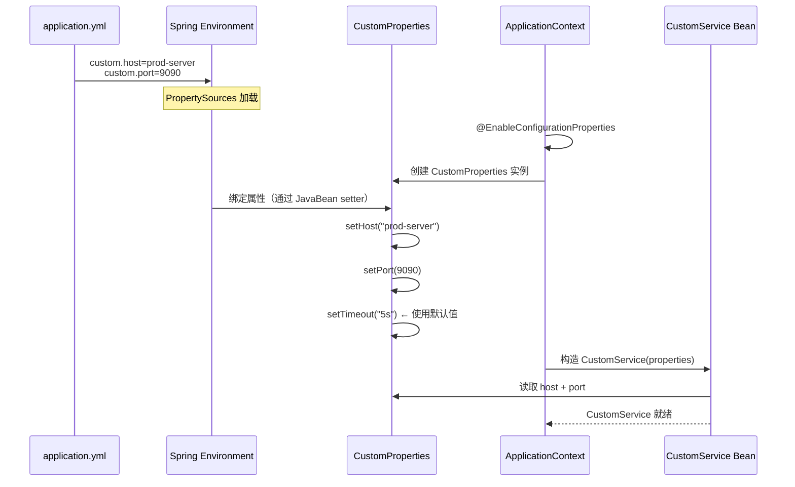

# Spring Boot Starter 机制

## 一、自定义 Starter 架构图

```mermaid
flowchart LR
    subgraph Starter["custom-spring-boot-starter"]
        direction TB
        POM["pom.xml<br/>引入 spring-boot-starter<br/>+ 所需依赖"]
        Props["CustomProperties.java<br/>@ConfigurationProperties(prefix=\"custom\")<br/>host / port / timeout"]
        AutoConfig["CustomAutoConfiguration.java<br/>@Configuration<br/>@EnableConfigurationProperties"]
        Service["CustomService.java<br/>对外暴露的核心服务"]
        Imports["META-INF/spring/<br/>org.springframework.boot.autoconfigure.AutoConfiguration.imports"]
    end

    subgraph Consumer["消费者应用"]
        YAML["application.yml<br/>custom:<br/>  host: prod-server<br/>  port: 9090"]
        App["Spring Boot 启动<br/>自动配置生效<br/>直接注入 CustomService"]
    end

    POM --> AutoConfig
    Props --> AutoConfig
    AutoConfig --> Service
    AutoConfig --> Imports
    Imports --> App
    YAML --> Props
    Props --> App
    Service --> App

    style Starter fill:#e3f2fd,stroke:#1976d2
    style Consumer fill:#e8f5e9,stroke:#388e3c
```

## 二、配置属性绑定序列图



## 三、Starter 目录结构

```
custom-spring-boot-starter/
├── pom.xml                                    # 引入 spring-boot-starter
├── src/main/java/com/example/custom/
│   ├── CustomProperties.java                  # @ConfigurationProperties(prefix="custom")
│   ├── CustomAutoConfiguration.java           # @Configuration + @EnableConfigurationProperties
│   └── CustomService.java                     # 对外暴露的核心服务
└── src/main/resources/
    └── META-INF/spring/
        └── org.springframework.boot.autoconfigure.AutoConfiguration.imports
```

## 四、核心组件说明

### 1. CustomProperties

```java
@ConfigurationProperties(prefix = "custom")
public class CustomProperties {
    private String host = "localhost";    // 默认值
    private int port = 8080;             // 默认值
    private String timeout = "5s";       // 默认值
    // getters and setters ...
}
```

**关键点：**
- `prefix` 定义了属性前缀，对应 `application.yml` 中的 `custom.*`
- 属性名自动与 YAML key 匹配（短横线 `server-host` 映射到 `serverHost`）
- 必须提供 getter/setter，否则无法绑定
- 默认值在字段声明中指定

### 2. CustomAutoConfiguration

```java
@Configuration
@EnableConfigurationProperties(CustomProperties.class)
@ConditionalOnClass(CustomService.class)
public class CustomAutoConfiguration {

    @Bean
    @ConditionalOnMissingBean
    public CustomService customService(CustomProperties properties) {
        return new CustomService(properties);
    }
}
```

**关键点：**
- `@EnableConfigurationProperties` 将属性类注册为 Bean
- `@ConditionalOnClass` 确保类路径上有对应类时才生效
- `@ConditionalOnMissingBean` 允许用户自定义覆盖

### 3. .imports 文件注册

```
com.example.custom.CustomAutoConfiguration
```

**关键点：**
- Spring Boot 2.7+ 推荐此格式
- 每行一个全限定类名
- 无需 key-value 格式，更简洁

## 五、消费者使用方式

### 1. 引入依赖

```xml
<dependency>
    <groupId>com.example</groupId>
    <artifactId>custom-spring-boot-starter</artifactId>
    <version>1.0.0</version>
</dependency>
```

### 2. 配置属性

```yaml
custom:
  host: prod-server.example.com
  port: 9090
  timeout: 30s
```

### 3. 注入使用

```java
@Service
public class MyService {
    @Autowired
    private CustomService customService;

    public void doSomething() {
        customService.execute();
    }
}
```

## 六、配置属性覆盖优先级

Spring Boot 属性源优先级（从高到低）：

1. 命令行参数 (`--custom.host=xxx`)
2. 系统环境变量 (`CUSTOM_HOST`)
3. `application-{profile}.yml`（profile 特定配置）
4. `application.yml`（主配置）
5. `@ConfigurationProperties` 类中定义的默认值

## 七、命名规范

| 类型 | 命名规范 | 示例 |
|------|----------|------|
| 官方 Starter | `spring-boot-starter-*` | `spring-boot-starter-web` |
| 第三方 Starter | `*-spring-boot-starter` | `mybatis-spring-boot-starter` |
| 自定义 Starter | 建议用后缀模式 | `custom-spring-boot-starter` |