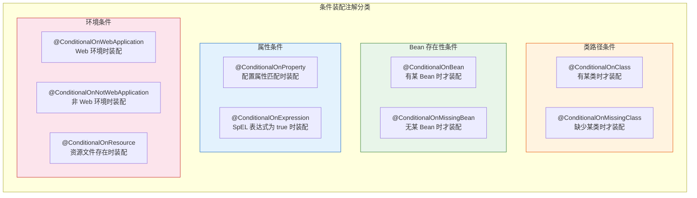
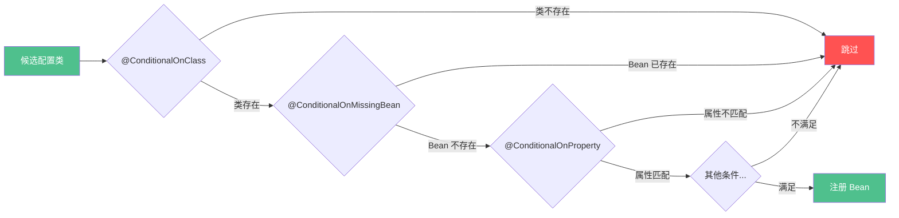
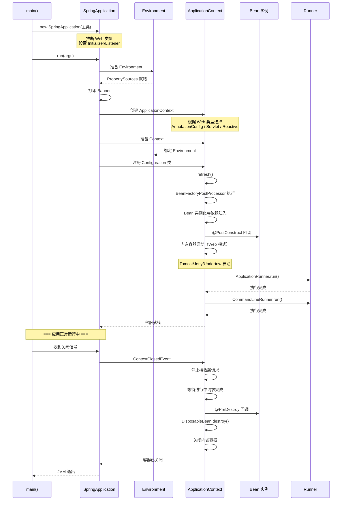

# Spring Boot 条件装配与生命周期

## 一、@Conditional 注解矩阵



## 二、条件装配优先级与短路求值



**核心规则：**
- 多个 `@ConditionalOnXxx` 之间是 **AND** 关系
- 任何一个条件不满足，整个配置类被跳过
- 这体现了 **短路求值**（short-circuit）思想
- 优先级：`@ConditionalOnClass` > `@ConditionalOnMissingBean` > `@ConditionalOnProperty` > `@Profile`

## 三、Spring Boot 生命周期时序图



## 四、ApplicationRunner vs CommandLineRunner

| 对比维度 | ApplicationRunner | CommandLineRunner |
|----------|-------------------|-------------------|
| 参数类型 | `ApplicationArguments`（解析后） | `String[] args`（原始） |
| 参数解析 | 自动分离 optionArgs / nonOptionArgs | 需要手动解析 |
| 适用场景 | 需要结构化的参数访问 | 简单场景或原始参数处理 |
| 执行顺序 | 先于 CommandLineRunner | 后于 ApplicationRunner |
| 多实例排序 | `@Order` 控制 | `@Order` 控制 |

```java
// ApplicationRunner -- 适合需要解析参数的场景
@Bean
ApplicationRunner appRunner() {
    return args -> {
        args.getOptionNames();         // ["server.port"]
        args.getOptionValues("server.port"); // ["8080"]
        args.getNonOptionArgs();       // []
    };
}

// CommandLineRunner -- 适合简单拿原始 args
@Bean
CommandLineRunner cmdRunner() {
    return args -> {
        System.out.println(Arrays.toString(args));
        // ["--server.port=8080", "--app.name=demo"]
    };
}
```

## 五、SpringApplication 自定义

| 配置项 | 方法 | 说明 |
|--------|------|------|
| Banner 模式 | `setBannerMode(Banner.Mode.OFF)` | 关闭启动 Banner |
| Web 类型 | `setWebApplicationType(NONE)` | 不启动内嵌容器 |
| 启动日志 | `setLogStartupInfo(false)` | 关闭启动信息日志 |
| Bean 覆盖 | `setAllowBeanDefinitionOverriding(true)` | 允许同名 Bean 覆盖 |
| 监听器 | `addListeners(...)` | 添加自定义 ApplicationListener |
| 初始化器 | `addInitializers(...)` | 添加 ApplicationContextInitializer |

## 六、内嵌 Tomcat 启动证明

**内嵌容器调用链（源码层面）：**

```
SpringApplication.run()
  → refreshContext(context)
    → ServletWebServerApplicationContext.onRefresh()
      → createWebServer()
        → getWebServerFactory()
          → TomcatServletWebServerFactory.getWebServer()
            → new Tomcat()             ← org.apache.catalina.startup.Tomcat
            → tomcat.start()           ← 启动内嵌容器
```

**判断依据：**

1. 不依赖外部 Tomcat 安装 → 独立 JAR 可直接运行
2. `spring-boot-starter-web` 依赖 `spring-boot-starter-tomcat`
3. 控制台日志: `o.s.b.w.embedded.tomcat.TomcatWebServer`
4. 可通过 `spring-boot-starter-undertow/jetty` 替换

## 七、优雅关闭机制

### 配置

```yaml
server:
  shutdown: graceful                     # 开启优雅关闭
spring:
  lifecycle:
    timeout-per-shutdown-phase: 30s     # 超时 30 秒
```

### 关闭流程

```
1. 收到关闭信号（SIGTERM / kill / context.close()）
2. Spring Boot 发布 ContextClosedEvent
3. 停止接收新请求（Web 容器层面）
4. 等待进行中的请求完成（server.shutdown=graceful）
5. 超时控制（spring.lifecycle.timeout-per-shutdown-phase）
6. @PreDestroy 回调
7. DisposableBean.destroy() 回调
8. 关闭内嵌容器
9. 关闭 ApplicationContext
10. JVM 退出
```