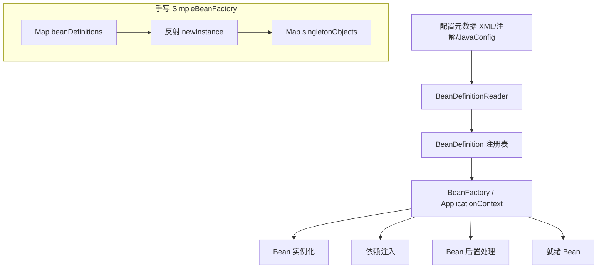
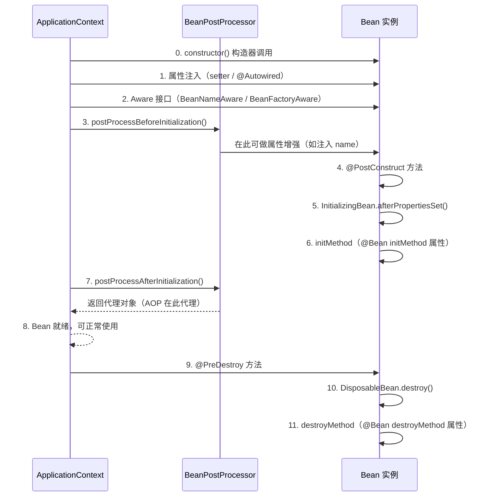

# IoC 容器与 Bean 生命周期

## 1. IoC（控制反转）核心原理

IoC 是一种设计思想：将对象的创建和依赖管理权从程序代码转移给容器。Spring IoC 容器负责：

- **Bean 定义的加载**：通过 XML / 注解 / Java Config 定义 Bean
- **依赖注入（DI）**：容器自动装配 Bean 之间的依赖关系
- **Bean 生命周期管理**：从创建到销毁的完整生命周期

### IoC 容器架构

## 2. Bean 生命周期 10 步序列图

## 3. 关键点总结

| 步骤 | 说明 | 典型用途 |
|------|------|----------|
| 0 | 构造器 | 创建 Bean 实例 |
| 1 | 属性注入 | @Autowired 字段 / setter 注入 |
| 2 | Aware 接口 | 获取容器资源（BeanName、ApplicationContext） |
| 3 | BeanPostProcessor#before | 在初始化前做属性修改或代理 |
| 4 | @PostConstruct | 初始化回调（推荐） |
| 5 | InitializingBean | 初始化回调（不推荐，耦合 Spring） |
| 6 | initMethod | @Bean 指定 initMethod |
| 7 | BeanPostProcessor#after | AOP 代理生成的关键节点 |
| 8 | Bean 就绪 | 正常业务使用 |
| 9 | @PreDestroy | 销毁前回调（推荐） |
| 10 | DisposableBean | 销毁回调（不推荐） |
| 11 | destroyMethod | @Bean 指定 destroyMethod |

### 重要规则

- **@PostConstruct > InitializingBean > initMethod**（初始化顺序）
- **@PreDestroy > DisposableBean > destroyMethod**（销毁顺序）
- **BeanPostProcessor#after 是 AOP 代理生成的关键位置**：如果需要代理，此处返回代理对象
- **BeanPostProcessor 必须用 static 方法注册**，否则会触发自身的 BeanPostProcessor 循环依赖问题

## 4. 运行验证

运行 `BeanLifecycleDemo.main()` 观察控制台输出顺序，验证 10 步生命周期是否正确。