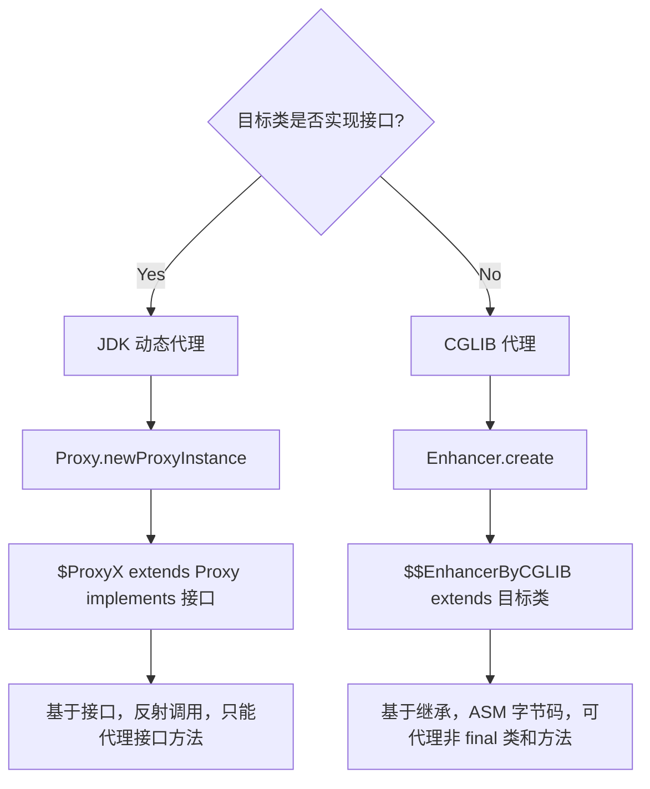
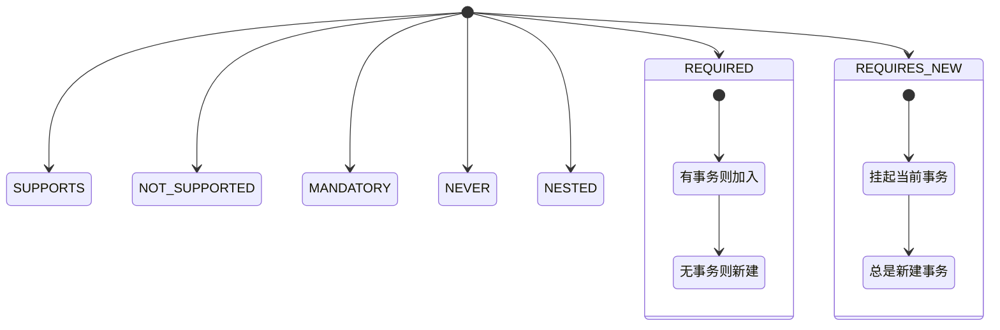
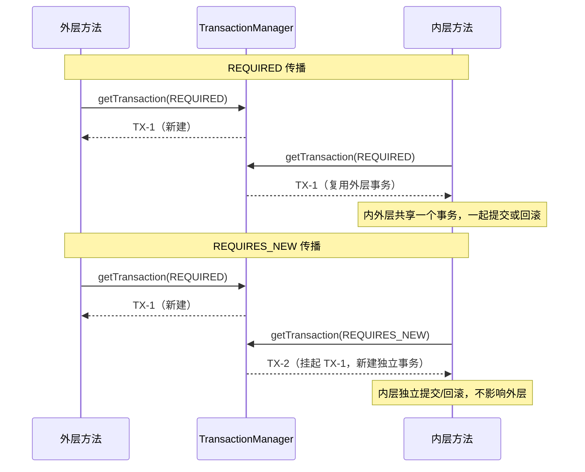
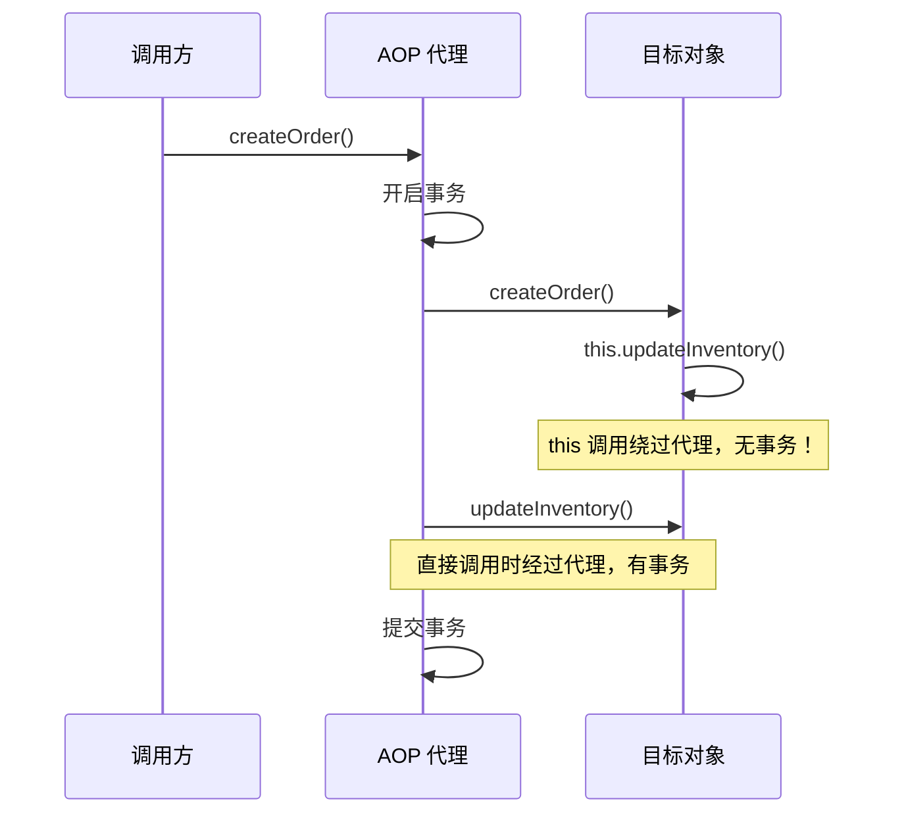

# AOP 代理与事务源码

## 1. AOP 核心概念

AOP（Aspect-Oriented Programming）面向切面编程，将横切关注点（日志、事务、安全）与业务逻辑分离。

### JDK 动态代理 vs CGLIB 代理



### JDK vs CGLIB 对比表

| 维度 | JDK 动态代理 | CGLIB 代理 |
|------|-------------|-----------|
| 实现方式 | Proxy.newProxyInstance | Enhancer.create |
| 代理原理 | 反射 + 接口实现 | ASM 字节码 + 继承 |
| 目标限制 | 必须实现接口 | 不能是 final 类 / final 方法 |
| 代理类名 | `$Proxy0` | `XXX$$EnhancerByCGLIB$$xxx` |
| 性能 | 反射调用稍慢 | 生成字节码快，执行快 |
| Spring 默认 | 目标有接口时使用 | 目标无接口时使用 |

## 2. Spring 事务传播机制



### REQUIRED vs REQUIRES_NEW 详细对比



## 3. @Transactional 自调用失效详解



### 失效原因

1. **AOP 代理机制**：@Transactional 基于 AOP 代理，只有通过代理对象调用方法才会被拦截
2. **this 调用**：方法内部 `this.method()` 直接调用目标对象，不经过代理，事务拦截器不生效
3. **代理对象 vs 目标对象**：Spring 容器中存储的是代理对象，但方法内的 `this` 指向目标对象本身

### 自调用调用链

```
ExternalCaller -> Proxy.createOrder() -> [事务开启] -> Target.createOrder()
    -> this.updateInventory()  // 不经过代理，事务不生效！
    -> Target.updateInventory() // 直接执行，无事务包装
```

### 解决方案

| 方案 | 实现方式 | 适用场景 |
|------|---------|---------|
| 注入自身代理 | `@Autowired private XxxService self;` 调用 `self.method()` | 通用，需要 @Lazy |
| AopContext | `((XxxService)AopContext.currentProxy()).method()` | 需开启 exposeProxy |
| 拆分到不同类 | 将内部方法抽取到独立 Service | 推荐，架构更清晰 |
| ApplicationContext | 从容器中获取代理 Bean | 较重，不推荐 |

## 4. 运行验证

- `AOPDemo.main()`：验证 JDK vs CGLIB 代理差异
- `TransactionalSourceAnalysis.main()`：验证事务传播与自调用失效