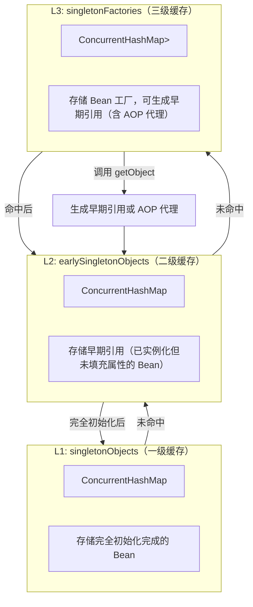
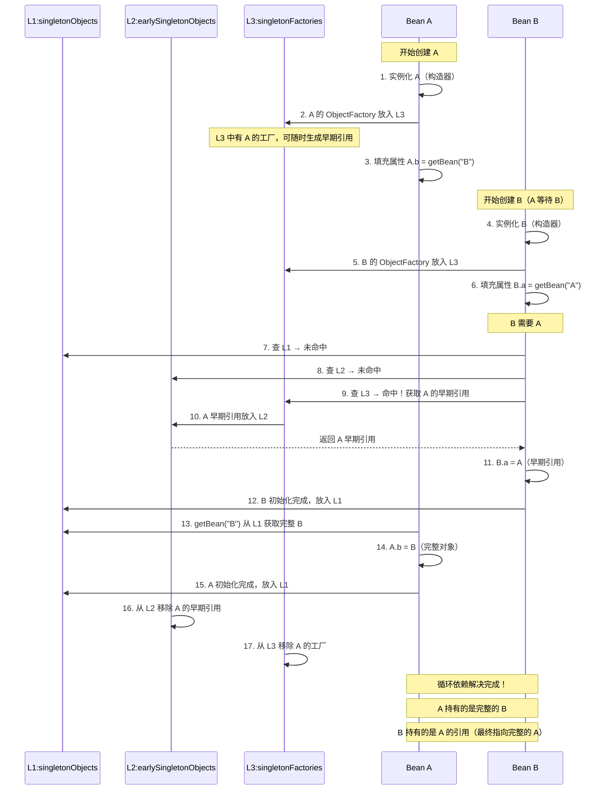
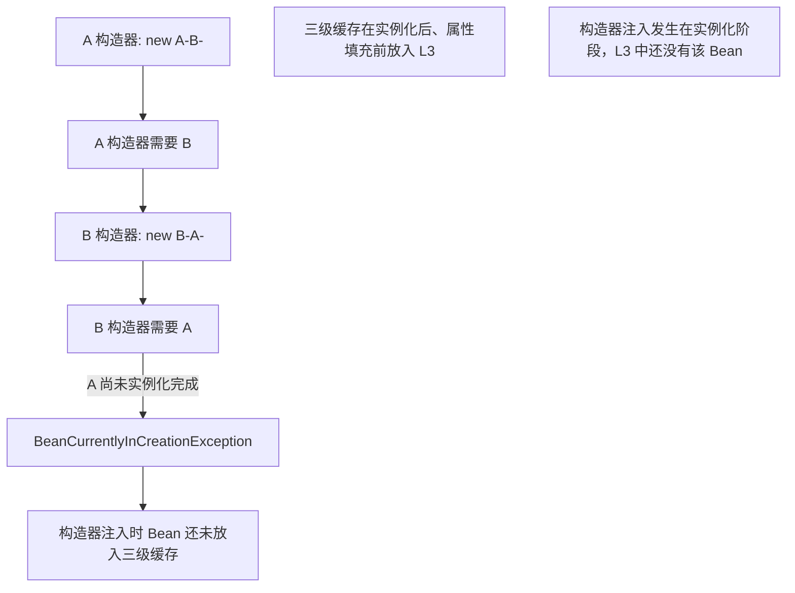

# 循环依赖与三级缓存

## 1. 什么是循环依赖

循环依赖指两个或多个 Bean 互相依赖，形成闭环：

```
A 依赖 B，B 依赖 A
A --> B --> A
```

## 2. 三级缓存结构



### 三级缓存核心代码流程

```
protected Object getSingleton(String beanName, boolean allowEarlyReference) {
    // L1: 从 singletonObjects 获取
    Object singletonObject = this.singletonObjects.get(beanName);
    if (singletonObject == null && isSingletonCurrentlyInCreation(beanName)) {
        // L2: 从 earlySingletonObjects 获取
        singletonObject = this.earlySingletonObjects.get(beanName);
        if (singletonObject == null && allowEarlyReference) {
            // L3: 从 singletonFactories 获取
            ObjectFactory<?> singletonFactory = this.singletonFactories.get(beanName);
            if (singletonFactory != null) {
                singletonObject = singletonFactory.getObject();
                this.earlySingletonObjects.put(beanName, singletonObject);
                this.singletonFactories.remove(beanName);
            }
        }
    }
    return singletonObject;
}
```

## 3. A -> B -> A 循环依赖解决过程



## 4. 为什么构造器注入无法解决循环依赖



### 构造器循环依赖无法解决的根本原因

1. Bean 先调用构造器实例化，再放入三级缓存（L3）
2. 构造器注入发生在实例化阶段，此时 Bean 还未进入三级缓存
3. 当 B 的构造器需要 A 时，A 正在创建中但不在任何缓存里
4. Spring 抛出 `BeanCurrentlyInCreationException`

### @Lazy 解决方案

```java
@Component
public class A {
    private final B b;

    public A(@Lazy B b) {  // @Lazy 延迟注入，先用代理占位
        this.b = b;
    }
}
```

@Lazy 原理：构造器注入时先注入一个 CGLIB 代理对象，等真正使用时再从容器获取真实 Bean。

## 5. 为什么需要三级缓存而不是二级

| 缓存级别 | 作用 | 为什么需要 |
|----------|------|-----------|
| L3 (singletonFactories) | Bean 工厂，可生成早期引用或 AOP 代理 | **解决 AOP 代理问题**——如果 Bean 需要 AOP 代理，L3 的工厂返回的是代理对象而非原始对象 |
| L2 (earlySingletonObjects) | 早期引用缓存 | 避免重复调用 L3 工厂（性能优化），保证同一个早期引用 |
| L1 (singletonObjects) | 完全初始化的 Bean | 对外暴露的完整 Bean |

**核心原因**：三级缓存不仅解决循环依赖，还要正确处理 AOP 代理。如果 A 需要 AOP，B 中注入的 A 必须是代理对象。L3 的 ObjectFactory 会根据需要返回代理或原始对象。

## 6. 运行验证

运行 `Q01_BeanFactory_ApplicationContext.main()` 观察三级缓存如何解决 A<->B 循环依赖。