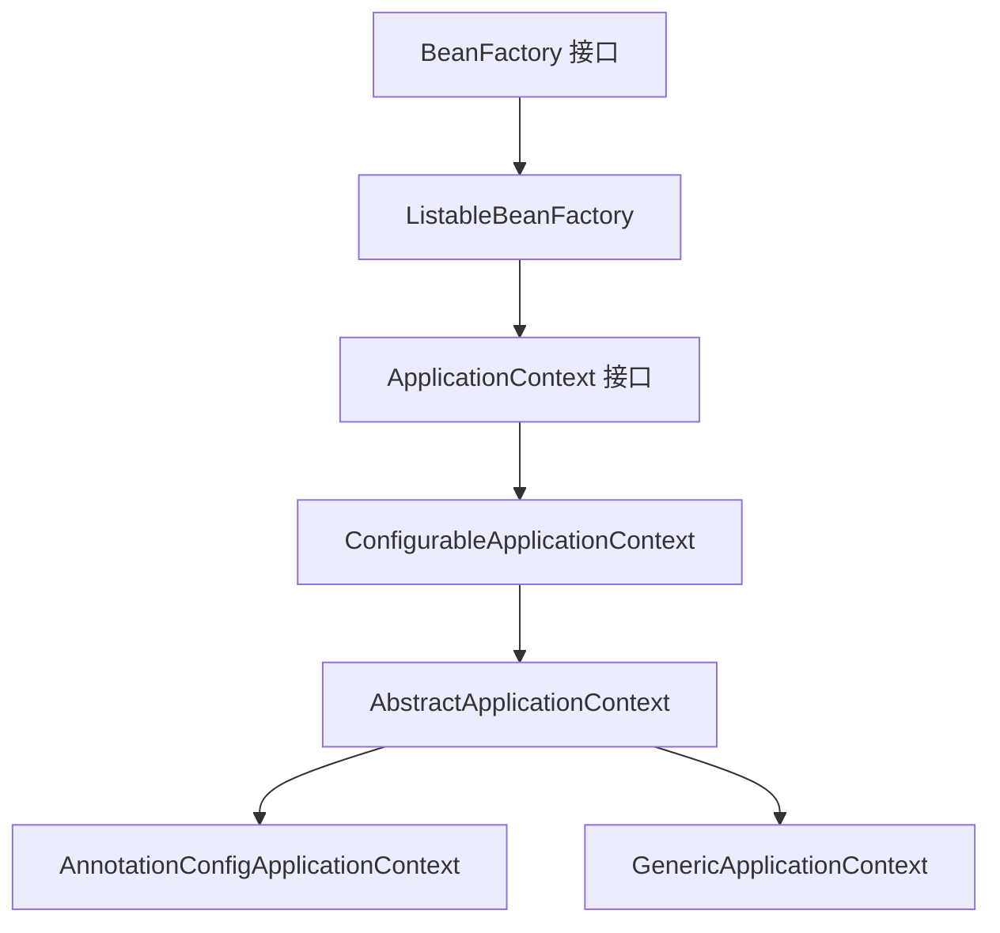
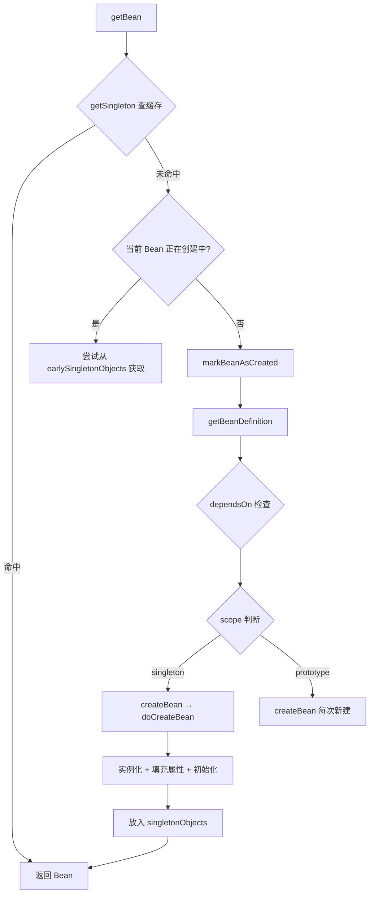
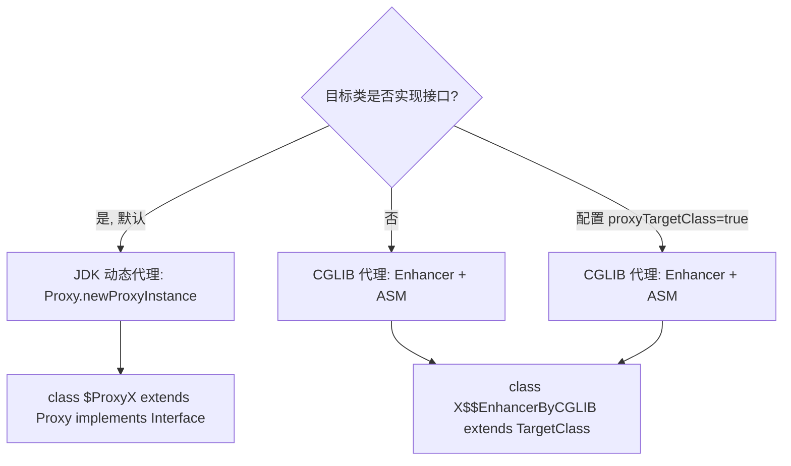

# Spring Core 面试高频问题

## Q1: IoC 与 DI 的区别

**IoC（控制反转）** 是一种设计思想，将对象创建和依赖管理的控制权从程序代码转移给外部容器。

**DI（依赖注入）** 是 IoC 的一种具体实现方式，容器动态地将依赖对象注入到目标对象中。

| 对比维度 | IoC | DI |
|---------|-----|-----|
| 本质 | 设计思想 / 原则 | 具体实现手段 |
| 关注点 | 谁控制对象的创建 | 如何将依赖传给对象 |
| 实现方式 | DI、Service Locator、Factory 等 | 构造器注入、Setter 注入、字段注入 |
| Spring 中 | IoC 容器（BeanFactory/ApplicationContext） | @Autowired、构造器参数注入 |

### 三种注入方式对比

| 注入方式 | 优点 | 缺点 | 推荐度 |
|---------|------|------|-------|
| 构造器注入 | 不可变、强制依赖、易测试 | 参数多时繁琐 | 最推荐 |
| Setter 注入 | 可选依赖、可重新配置 | 可变、可能 NPE | 可选依赖时用 |
| 字段注入 | 代码简洁 | 不可测试、隐藏依赖、DI 容器绑定 | 不推荐 |

---

## Q2: BeanFactory vs ApplicationContext

| 特性 | BeanFactory | ApplicationContext |
|------|------------|-------------------|
| 定位 | 底层 IoC 容器接口 | 高级 IoC 容器接口 |
| 实例化时机 | 懒加载（getBean 时才创建） | 预加载（容器启动时创建所有单例） |
| 国际化 MessageSource | 不支持 | 支持 |
| 事件发布 ApplicationEvent | 不支持 | 支持 |
| 环境抽象 Environment | 不支持 | 支持 |
| 资源加载 ResourceLoader | 不支持 | 支持 |
| 自动 BeanPostProcessor 注册 | 需手动 | 自动 |
| AOP 集成 | 需手动 | 自动 |

### 继承关系



### doGetBean 核心流程



---

## Q3: Spring AOP 原理

### AOP 核心概念

| 概念 | 说明 |
|------|------|
| Aspect（切面） | 横切关注点的模块化，包含 Advice 和 Pointcut |
| JoinPoint（连接点） | 程序执行中的某个点（方法调用、异常抛出） |
| Pointcut（切入点） | 匹配 JoinPoint 的表达式 |
| Advice（通知） | 在特定 JoinPoint 执行的增强逻辑 |
| Weaving（织入） | 将 Aspect 应用到目标对象创建代理的过程 |

### 代理选择策略



### Spring Boot 2.x 之后的变化

Spring Boot 2.0 以后默认使用 CGLIB 代理（`spring.aop.proxy-target-class=true`）。原因：
- JDK 代理只能代理接口方法，非接口方法无法增强
- CGLIB 更通用，避免类型转换异常

---

## Q4: Spring 循环依赖

### 三级缓存结构

| 缓存 | 名称 | 存储内容 |
|------|------|---------|
| L1 | singletonObjects | 完全初始化的 Bean |
| L2 | earlySingletonObjects | 早期引用（已实例化但属性未填充） |
| L3 | singletonFactories | ObjectFactory，可生成早期引用或 AOP 代理 |

### A -> B -> A 解决过程

1. A 实例化（构造器调用）后，将 A 的 ObjectFactory 放入 L3
2. A 填充属性，调用 getBean("B")
3. B 实例化后，将 B 的 ObjectFactory 放入 L3
4. B 填充属性，调用 getBean("A")
5. 从 L3 获取 A 的 ObjectFactory，生成 A 的早期引用，放入 L2
6. B 拿到 A 的早期引用，完成初始化，放入 L1
7. A 拿到完整的 B，完成初始化，放入 L1

### 无法解决的场景

| 场景 | 原因 |
|------|------|
| 构造器注入循环依赖 | 实例化阶段 Bean 未进入三级缓存，无法获取早期引用 |
| prototype 作用域循环依赖 | prototype 不放入三级缓存，无法提前暴露 |
| @Async 循环依赖 | @Async 的代理类型可能与原始 Bean 类型不同 |

---

## Q5: @Transactional 失效场景

### 8 大失效场景

| 序号 | 场景 | 原因 | 解决方案 |
|------|------|------|---------|
| 1 | **自调用** | this.method() 绕过代理 | 注入自身代理 / AopContext / 拆分 |
| 2 | **非 public 方法** | CGLIB 无法代理非 public 方法 | 改为 public |
| 3 | **异常被 catch 吞掉** | Spring 感知不到异常 | catch 中手动回滚或重新抛出 |
| 4 | **非运行时异常** | 默认只回滚 RuntimeException/Error | 设置 rollbackFor = Exception.class |
| 5 | **数据库引擎不支持** | MyISAM 不支持事务 | 使用 InnoDB |
| 6 | **多线程调用** | 事务绑定线程，子线程无事务 | 不在子线程使用事务 |
| 7 | **final 类 / final 方法** | CGLIB 通过继承实现，final 不可继承 | 去掉 final |
| 8 | ** propagation 配置错误** | 如 MANDATORY 无事务抛异常 | 检查传播行为 |

### 自调用调用链详解

```
调用方 -> Proxy.createOrder()                 // 经过 AOP，事务生效
    -> Advisor.TransactionInterceptor.invoke()
        -> TransactionAspectSupport.createTransactionIfNecessary()
        -> Target.createOrder()               // 实际调用
            -> this.updateInventory()          // this 不经过代理！
                -> Target.updateInventory()    // 无事务包装！
        -> TransactionAspectSupport.commitTransactionAfterReturning()
```

### 最佳实践

1. **事务方法放在独立 Service 类中**，避免自调用
2. **明确设置 rollbackFor = Exception.class**
3. **事务方法不要 catch 异常后吞掉**
4. **事务方法尽量简短**，不在事务中做 RPC 调用、文件 IO
5. **使用 @Transactional(readOnly = true) 优化只读事务**
6. **注意事务传播行为**，不要滥用 REQUIRES_NEW