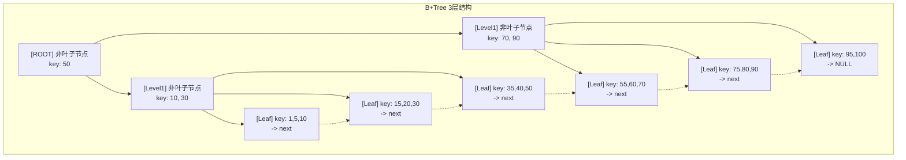
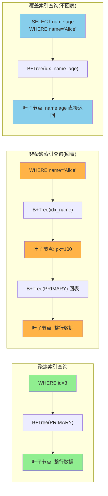
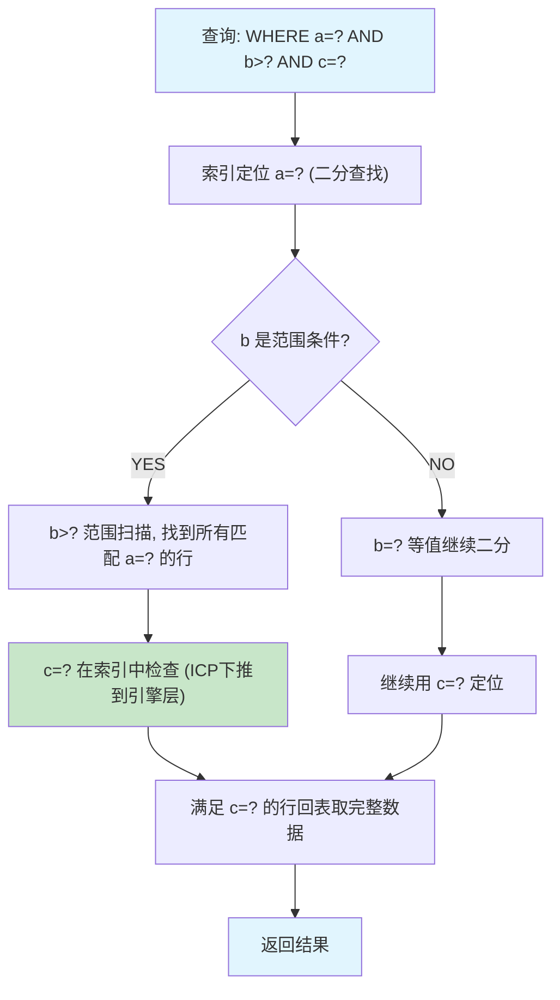

# 01-索引底层原理

## B+Tree 结构



### B+Tree 核心特性

| 特性 | 说明 |
|------|------|
| 数据只存叶子节点 | 非叶子节点只存 key，不存 data |
| 叶子节点有序链表 | 支持范围查找，顺序遍历 |
| 树高度稳定 | 通常 2-4 层，千万级数据 3 层足够 |
| 每个节点多 key | 通常 16KB 页存约 1000 个 key |

### 千亿数据 3-4 层够用计算

```
一个 16KB 的 InnoDB 页:
  - 主键 BIGINT (8字节) + 指针 (6字节) = 14字节/条目
  - 每页约 16KB / 14B ≈ 1170 个索引条目
  - 叶子节点: 每行约 1KB，每页约 16 行

层数计算:
  第1层(root): 1 页, 1170 个指针
  第2层: 1170 页, 1170*1170 ≈ 137万 个指针
  第3层(叶子): 137万 页, 137万*16 ≈ 2190万 行数据

结论: 3 层 B+Tree 可存储约 2000 万行记录
      4 层 B+Tree 可存储约 256 亿行记录
```

## 聚簇索引 vs 非聚簇索引 vs 覆盖索引



| 对比项 | 聚簇索引 | 非聚簇索引 | 覆盖索引 |
|--------|----------|------------|----------|
| 叶子存储 | 整行数据 | 主键值 | 查询所需列 |
| 每表数量 | 仅 1 个 | 多个 | 非独立类型 |
| IO 次数 | 1 次 | >= 2 次 | 1 次 |
| Extra 标识 | - | Using index condition | Using index |

## 最左前缀原则 + ICP 下推



### 最左前缀口诀

```
索引 (a, b, c):

age>20         -> range        (不用索引排序)

= 等值匹配，范围匹配不用索引排序
范围匹配不用索引排序
范围匹配不用索引排序a = ?                     -> ref          (全部命中)
a = ? AND b = ?            -> ref          (全部命中，b紧跟a)
a = ? AND b = ? AND c = ?  -> ref/const    (全部命中)
a = ? AND c = ?            -> ref(a)       (a可用，c跳过b失效)
b = ? AND c = ?            -> index/ALL    (跳过a，全失效)
a = ? AND b > ? AND c = ?  -> ref(a)+range(b) (a=ref, b=range, c失效)
a = ? AND b = ? ORDER BY c -> ref(a,b)+file sort(c排序走索引)
ORDER BY a,b,c             -> index        (全排序走索引)
```

### ICP 下推关键点

- MySQL 5.6+ 支持
- 存储引擎在索引遍历时直接过滤 WHERE 条件
- 减少回表次数，降低 Server 层与引擎层数据传输
- 适用条件：`Using index condition`，需要索引覆盖 WHERE 的部分列