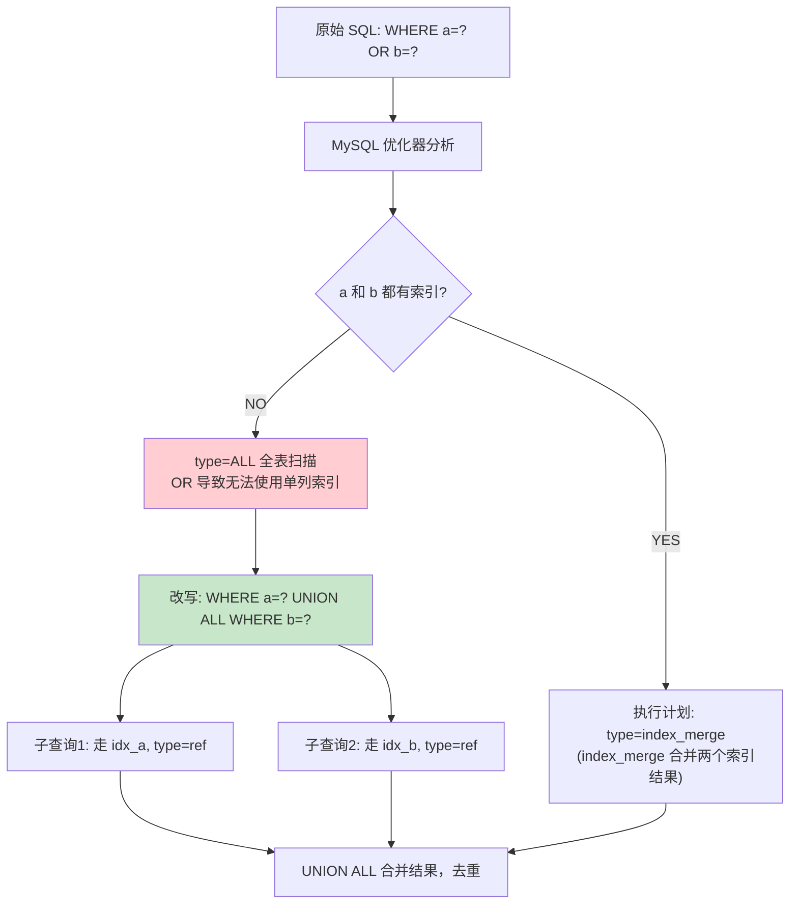
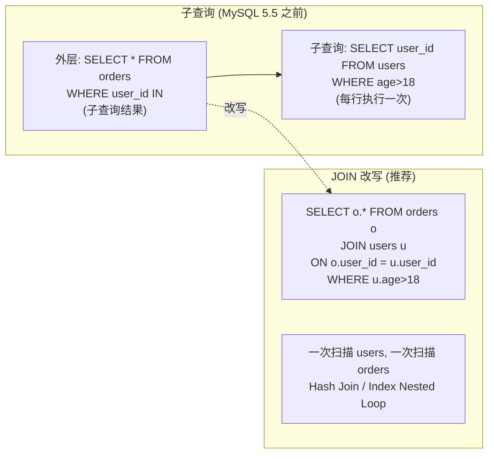
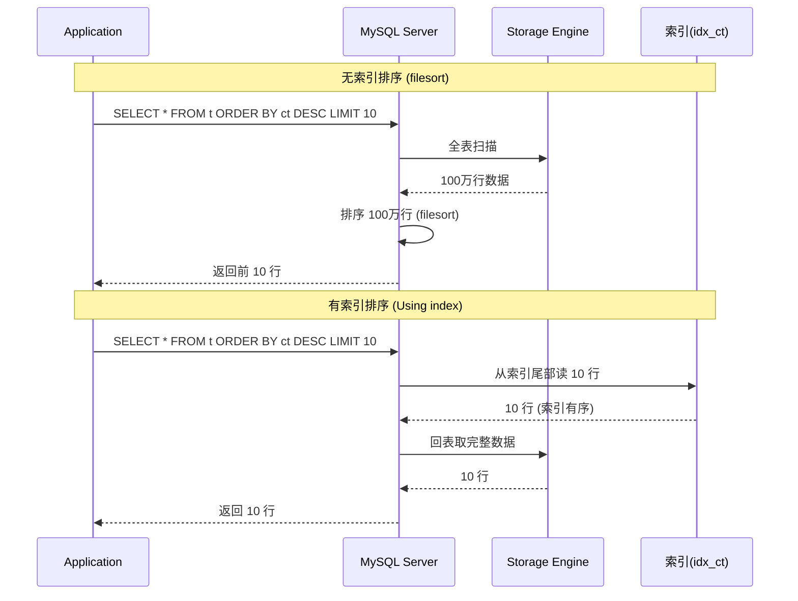

# 02-SQL 优化实战

## OR -> UNION ALL 改写流程



### OR 不走索引的原因

```
WHERE name='Alice' OR age=25

B+Tree 索引结构:
  idx_name: 按 name 排序，无法定位 age=25
  idx_age:  按 age 排序，无法定位 name='Alice'

  OR 条件要求结果集是两个条件的并集
  单个索引无法同时满足两个维度的等值查找
  结果: 优化器放弃索引，走全表扫描

改写为 UNION ALL:
  (SELECT * FROM t WHERE name='Alice')  -- 走 idx_name
  UNION ALL
  (SELECT * FROM t WHERE age=25)        -- 走 idx_age
  每个子查询独立使用自己的最优索引
```

## 子查询 -> JOIN 改写



| 对比 | 子查询 (IN) | JOIN 改写 |
|------|------------|-----------|
| 执行方式 | 外层每行执行子查询 | 两表关联一次扫描 |
| 驱动表 | 不可控 | 小表驱动大表 |
| 索引利用 | 子查询内部可能走索引 | 关联字段可用索引 |
| MySQL 5.6+ | 半连接优化(semi-join) | 已有优化，但仍推荐 JOIN |

## ORDER BY + LIMIT 优化



### filesort vs index 排序对比

| 场景 | Extra 信息 | 排序方式 | IO | 代价 |
|------|-----------|---------|-----|------|
| ORDER BY non_index_col | Using filesort | 内存/磁盘排序 | 全表扫描 | O(N log N) |
| ORDER BY indexed_col | Using index | 索引顺序读 | 索引扫描 + 回表 | O(log N + K) |
| WHERE a=? ORDER BY b | Using filesort | 过滤后排序 | 索引 + 排序 | O(M log M) |
| INDEX(a,b), WHERE a=? ORDER BY b | - | 索引有序 | 索引扫描 | O(log N + M) |

### filesort 内存阈值

```
sort_buffer_size (默认 256KB):
  - 排序数据 < sort_buffer_size: 内存排序(快)
  - 排序数据 > sort_buffer_size: 磁盘临时文件排序(慢)

max_length_for_sort_data (默认 1024字节):
  - 单行 < 该值: 全字段排序(一次回表)
  - 单行 > 该值: rowid 排序(两次回表)
```

## SELECT * 改写

| 问题 | 说明 |
|------|------|
| 网络开销 | 返回不需要的列，增加网络传输 |
| 覆盖索引失效 | 即使索引覆盖所有 WHERE 列，SELECT * 仍需回表 |
| 内存消耗 | 结果集在 Server 层占更多内存 |
| JOIN 膨胀 | JOIN 结果集列数 = 所有表列之和 |
| 表结构变更影响 | 新增列可能导致程序 OOM |