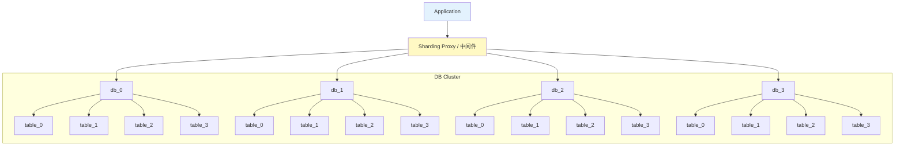
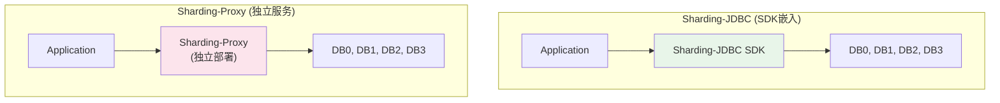
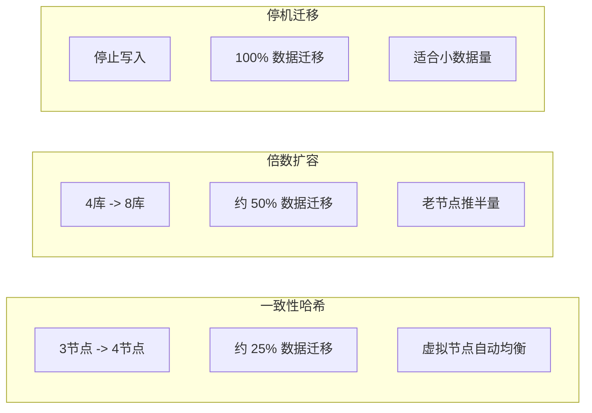

# 03-分库分表方案

## 4库4表 16分片架构



### 路由算法

```
分片键: user_id
分片总数: 4库 * 4表 = 16

路由:
  shard = hash(user_id) % 16
  db_index = shard / 4       (0=db_0, 1=db_0, 2=db_0, 3=db_0, 4=db_1...)
  table_index = shard % 4    (0=table_0, 1=table_1, 2=table_2, 3=table_3)

示例:
  user_id=1001 -> hash(1001) % 16 = 9 -> db_2.table_1
  user_id=1002 -> hash(1002) % 16 = 2 -> db_0.table_2
```

## Sharding-Proxy / Sharding-JDBC 架构



| 方案 | 优势 | 劣势 |
|------|------|------|
| Sharding-JDBC | 无额外部署, 性能高, 语言层面 | 仅 Java, 升级需重启 |
| Sharding-Proxy | 多语言支持, 独立运维, 透明 | 多一跳网络延迟 |
| MyCat | 成熟稳定, 功能丰富 | 社区活跃度下降 |
| DRDS(阿里) | 托管服务, 自动运维 | 云绑定, 成本高 |
| Vitess | 大规模验证(YouTube) | 运维复杂 |

## 扩容方案对比



| 方案 | 数据迁移量 | 停机 | 自动均衡 | 复杂度 | 适用 |
|------|-----------|------|---------|--------|------|
| 一致性哈希 | ~1/N | 否 | 是 | 中 | 缓存扩容 |
| 虚拟槽 | 可控 | 否 | 是 | 高 | Redis/DB |
| 倍数扩容 | ~50% | 否 | 否 | 高 | MySQL分片 |
| 停机迁移 | 100% | 是 | 否 | 低 | 允许停机窗口 |

### 倍数扩容详细流程

```
2库 -> 4库 扩容:
  Step 1: 部署新库 db_2, db_3 (空库)
  Step 2: 双写: 写入同时写到新旧两套集群
  Step 3: 迁移历史数据: db_0 中 user_id%4==2 的行 -> db_2
                        db_1 中 user_id%4==3 的行 -> db_3
  Step 4: 校验数据一致性
  Step 5: 停止写旧集群，切读流量到新集群
  Step 6: 下线旧库 db_0, db_1

  迁移量: user_id % 4 == 2 或 3 的数据 -> 50%
  不变:   user_id % 4 == 0 或 1 的数据 -> 50% 仍在原库
```

## 基因法 ID 嵌入原理

```
目标: 根据 order_id 路由时，相同 user_id 的订单落在同一分片

传统方案:
  user_id=1001 -> shard_9
  order_id=888 -> shard_7  (与 user_id 不同分片!)
  查用户订单需要跨分片

基因法:
  gene = user_id & 0xF  (取 user_id 低4位作为基因)
  如 user_id=1001, gene = 1001 & 0xF = 9

  embedded_order_id = (order_id << 4) | gene
  如 order_id=888 -> embedded = 888*16 + 9 = 14217

  shard(embedded) = 14217 % 16 = 9  -> 与 user_id 相同分片!

  解码: 从 embedded_order_id 提取基因 -> 直接定位分片
       或 查 user_id=%d AND order_id 在后缀匹配
```

### 基因法示意图

```
order_id = 888        (binary: 11 0111 1000)
gene     = 1001 & 0xF (binary: 1001)

embedded = (888 << 4) | 1001
         = 11 0111 1000 0000 | 1001
         = 11 0111 1000 1001
         = 14217

路由: 14217 % 16 = 9  (与 user_id=1001 % 16 = 9 相同)
```