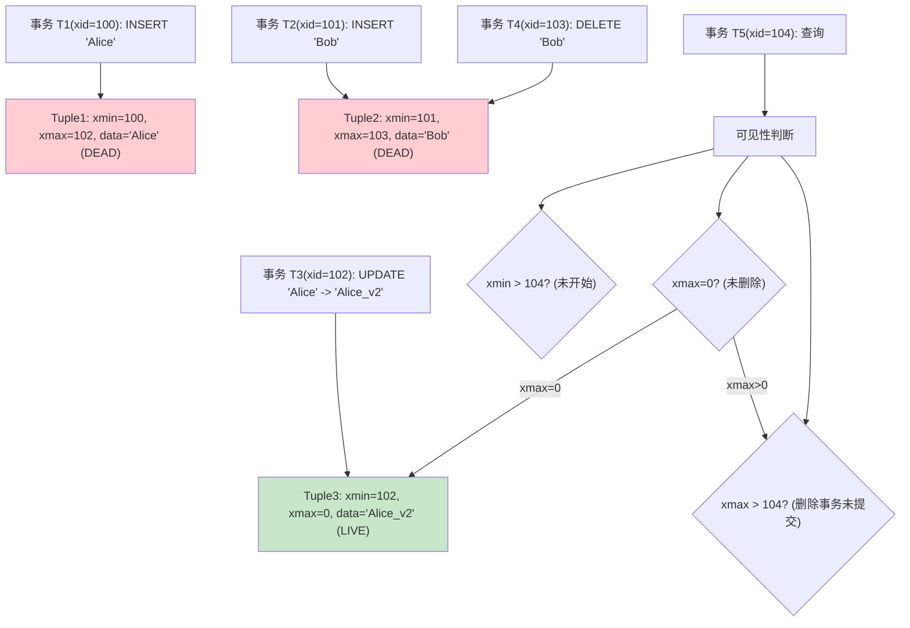
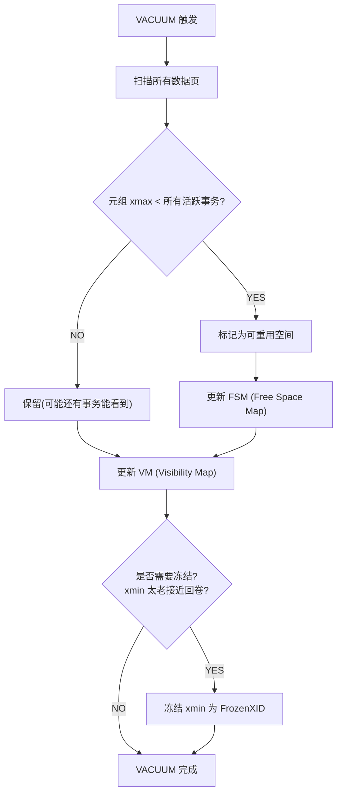

# 04-PostgreSQL 与 Oracle 特性

## PG MVCC 元组可见性



### MVCC 核心字段

| 字段 | 含义 | 值 |
|------|------|-----|
| xmin | 创建该版本的事务 ID | 插入时的事务 ID |
| xmax | 删除该版本的事务 ID | 0=未删除, >0=被该事务删除 |
| cmin/cmax | 同一事务内的命令序号 | 用于同一事务内可见性 |

### 事务隔离级别与可见性

| 隔离级别 | 脏读 | 不可重复读 | 幻读 | PG 实现 |
|---------|------|----------|------|---------|
| Read Uncommitted | 不可能 | 可能 | 可能 | 等同于 Read Committed |
| Read Committed | 不可能 | 可能 | 可能 | 默认，每语句一个快照 |
| Repeatable Read | 不可能 | 不可能 | 不可能 | 事务开始时的快照 |
| Serializable | 不可能 | 不可能 | 不可能 | SSI 串行化快照隔离 |

## VACUUM 过程



### VACUUM 类型

| 类型 | 触发方式 | 特点 |
|------|---------|------|
| 手动 VACUUM | `VACUUM table;` | 标记回收空间，不归还 OS |
| 手动 VACUUM FULL | `VACUUM FULL table;` | 锁表，完全重写，归还 OS 空间 |
| 自动 VACUUM | autovacuum daemon | 基于阈值自动触发 |
| FREEZE | 防止事务 ID 回卷 | 冻结老旧 xmin |

### autovacuum 触发阈值

```
autovacuum_vacuum_scale_factor = 0.2 (20%)
autovacuum_vacuum_threshold = 50

触发: dead_tuples > threshold + scale_factor * total_rows
示例: 表 10000 行 -> dead > 50 + 10000*0.2 = 2050 行触发
```

## Oracle vs MySQL 分页对比

| 特性 | Oracle (旧) | Oracle (12c+) | MySQL | PostgreSQL |
|------|------------|---------------|-------|------------|
| 语法 | ROWNUM 三层嵌套 | OFFSET...FETCH | LIMIT offset,count | LIMIT/OFFSET |
| 首页 | `WHERE ROWNUM<=10` | `FETCH FIRST 10 ROWS` | `LIMIT 10` | `LIMIT 10` |
| 第N页 | 三层子查询 | `OFFSET N ROWS` | `LIMIT N,10` | `LIMIT 10 OFFSET N` |
| 性能 | 差(全扫描) | 索引条件下推 | 较好(优先索引) | 一般 |

### ROWNUM 陷阱

```sql
-- 错误: ROWNUM 在 ORDER BY 之前赋值
SELECT * FROM emp WHERE ROWNUM <= 10 ORDER BY salary DESC;
-- 结果: 先随机取10行，然后排序，不是 salary 最高的10个

-- 正确: 三层嵌套
SELECT * FROM (
  SELECT a.*, ROWNUM rn FROM (
    SELECT * FROM emp ORDER BY salary DESC
  ) a WHERE ROWNUM <= 10
) WHERE rn >= 1;
```

## Kingbase 兼容模式对比

| 特性 | Oracle 模式 | MySQL 模式 | PostgreSQL 模式 |
|------|------------|------------|-----------------|
| 空串处理 | '' = NULL | '' != NULL | '' != NULL |
| 标识符大小写 | 默认大写 | 默认小写 | 默认小写 |
| 分页语法 | ROWNUM / OFFSET FETCH | LIMIT | LIMIT |
| 自增列 | SEQUENCE | AUTO_INCREMENT | SERIAL |
| UPSERT | MERGE INTO | INSERT ON DUPLICATE | INSERT ON CONFLICT |
| 字符串拼接 | `\|\|` | CONCAT() | `\|\|` |
| 存储过程 | PL/SQL 兼容 | 需改写 | PL/pgSQL |

### 迁移常见问题

1. **数据类型映射**: NUMBER(p,s) -> NUMERIC(p,s), VARCHAR2 -> VARCHAR, CLOB -> TEXT
2. **空串问题**: Oracle 模式 '' = NULL，可能导致唯一约束冲突
3. **日期函数**: SYSDATE -> NOW(), TO_DATE -> TO_TIMESTAMP
4. **序列**: Oracle 模式自动创建，MySQL 模式需 `CREATE SEQUENCE`
5. **存储过程**: 设置 `plsql_mode=oracle` 提升兼容性
6. **外连接语法**: Oracle `(+)` 不兼容，统一用 ANSI JOIN