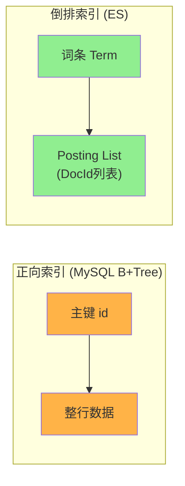
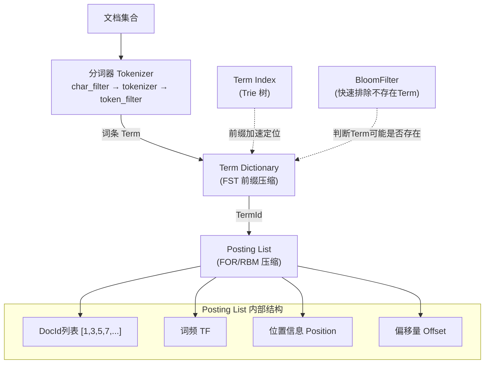
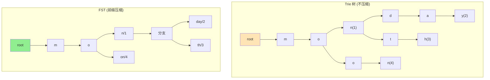
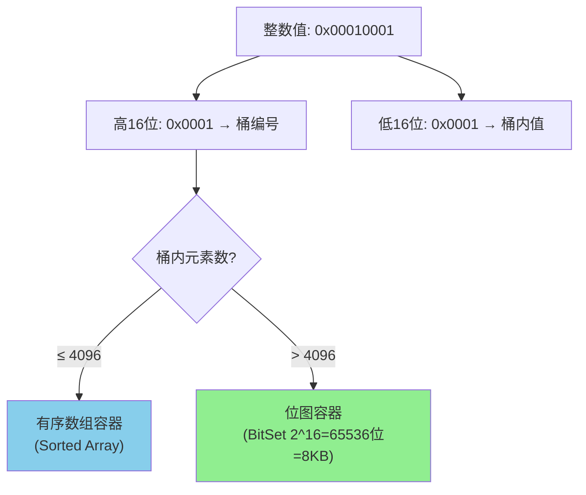
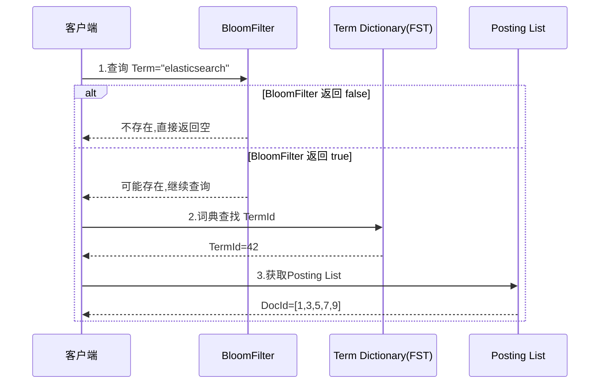
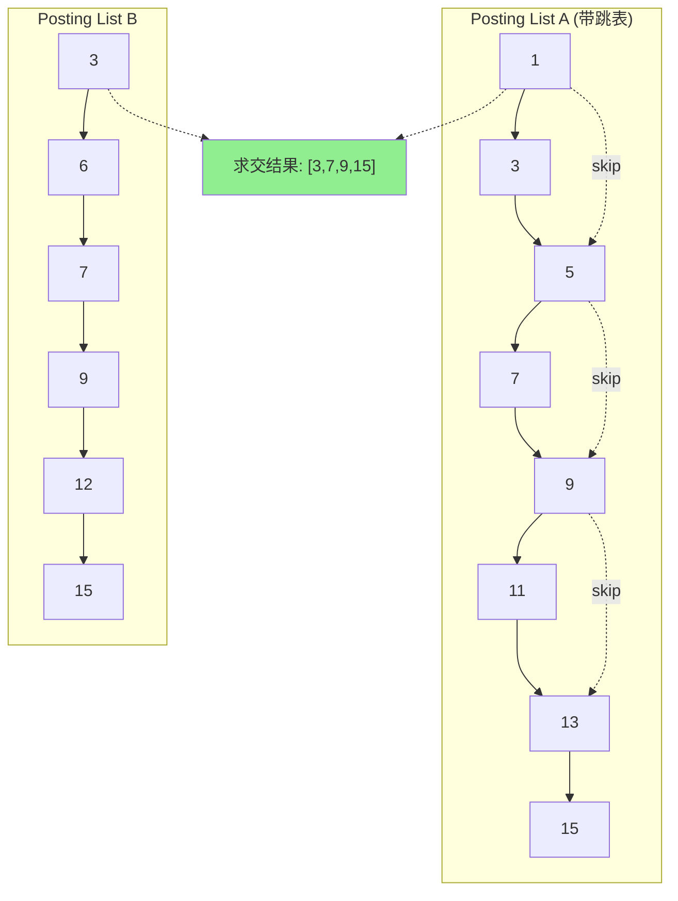

# 01-倒排索引原理

## 倒排索引 vs 正向索引

**核心思想：词 -> 文档 的反向映射**

## ES 倒排索引完整结构

## FST(Finite State Transducer) vs Trie

| 对比 | Trie | FST |
|------|------|-----|
| 存储结构 | 树状,每节点存字符 | 图状,共享前缀+后缀 |
| 内存占用 | 较大 | 极小(可全加载到内存) |
| ES 用途 | Term Index | Term Dictionary |

## Posting List 压缩

### FOR(Frame Of Reference) 增量编码

### RBM(Roaring Bitmap) 分桶

## 搜索流程

## 跳表加速 Posting List 求交

**关键**: 跳表每 3 个元素建一个跳跃指针,当 A 的当前值 < B 的当前值时,利用跳跃指针快速跳过不可能重合的区间,避免逐元素比较。