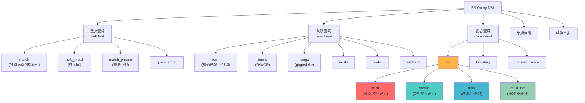
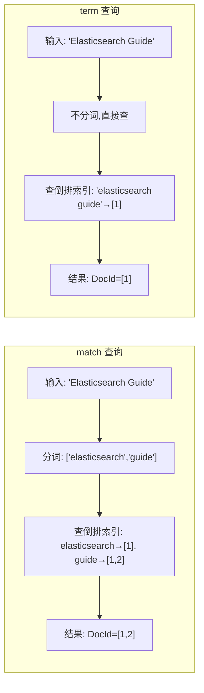
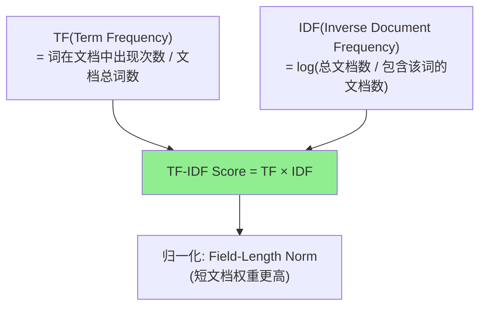
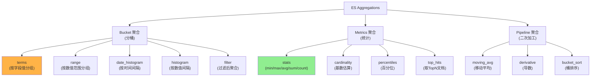
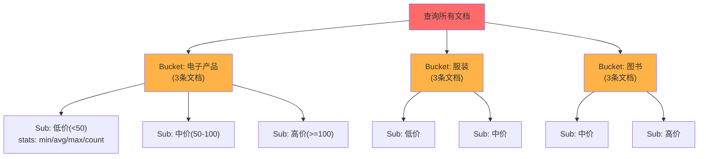
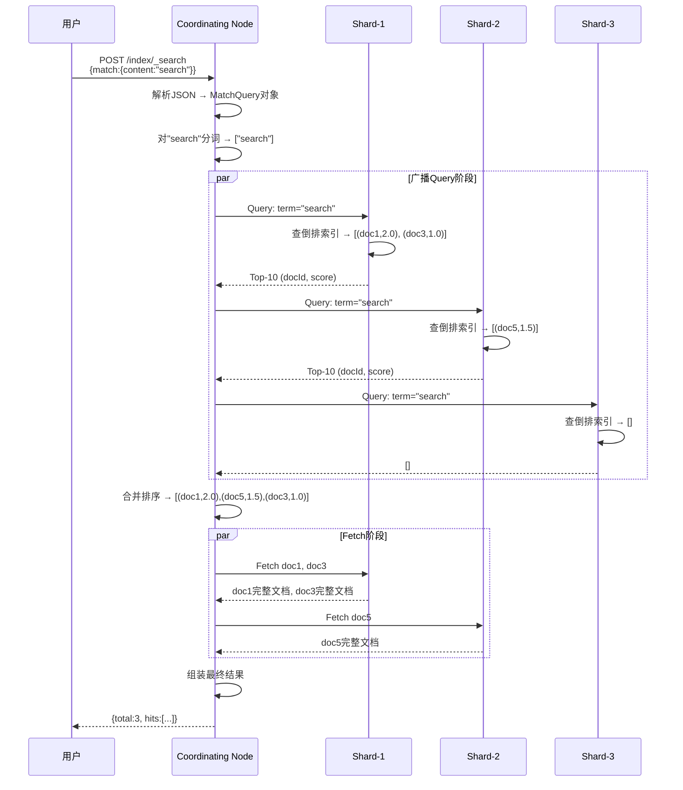

# 02-DSL查询与聚合

## DSL 查询体系

```mermaid
graph TD
    DSL["ES Query DSL"]
    DSL --> FULL["全文查询<br/>Full Text"]
    DSL --> TERM["词项查询<br/>Term Level"]
    DSL --> COMPOUND["复合查询<br/>Compound"]
    DSL --> GEO["地理位置"]
    DSL --> SPECIAL["特殊查询"]

    FULL --> MATCH["match<br/>(分词后查倒排索引)"]
    FULL --> MLT["multi_match<br/>(多字段)"]
    FULL --> MQP["match_phrase<br/>(短语匹配)"]
    FULL --> QS["query_string"]

    TERM --> TE["term<br/>(精确匹配,不分词)"]
    TERM --> TE2["terms<br/>(多值OR)"]
    TERM --> RA["range<br/>(gt/gte/lt/lte)"]
    TERM --> EX["exists"]
    TERM --> PR["prefix"]
    TERM --> WC["wildcard"]

    COMPOUND --> BOOL["bool"]
    BOOL --> MUST["must<br/>(AND,参与评分)"]
    BOOL --> SHOULD["should<br/>(OR,参与评分)"]
    BOOL --> FILTER["filter<br/>(过滤,不评分)"]
    BOOL --> MUSTNOT["must_not<br/>(NOT,不评分)"]

    COMPOUND --> BOOST["boosting"]
    COMPOUND --> CONST["constant_score"]

    style BOOL fill:#FFB347
    style MUST fill:#FF6B6B
    style SHOULD fill:#4ECDC4
    style FILTER fill:#45B7D1
    style MUSTNOT fill:#96CEB4
```

## match vs term 本质区别

```mermaid
flowchart LR
    subgraph "match 查询"
        M_IN["输入: 'Elasticsearch Guide'"]
        M_TOK["分词: ['elasticsearch','guide']"]
        M_IDX["查倒排索引: elasticsearch→[1], guide→[1,2]"]
        M_RES["结果: DocId=[1,2]"]
    end

    subgraph "term 查询"
        T_IN["输入: 'Elasticsearch Guide'"]
        T_NO["不分词,直接查"]
        T_IDX["查倒排索引: 'elasticsearch guide'→[1]"]
        T_RES["结果: DocId=[1]"]
    end

    M_IN --> M_TOK --> M_IDX --> M_RES
    T_IN --> T_NO --> T_IDX --> T_RES
```

## TF-IDF 评分公式

```mermaid
graph TD
    TF["TF(Term Frequency)<br/>= 词在文档中出现次数 / 文档总词数"]
    IDF["IDF(Inverse Document Frequency)<br/>= log(总文档数 / 包含该词的文档数)"]
    SCORE["TF-IDF Score = TF × IDF"]
    NL["归一化: Field-Length Norm<br/>(短文档权重更高)"]

    TF --> SCORE
    IDF --> SCORE
    SCORE --> NL

    style SCORE fill:#90EE90
```

**BM25(ES 5.0+ 默认)改进**: 引入词饱和度控制和文档长度归一化,避免 TF 无限增长。

## 聚合体系

```mermaid
graph TD
    AGGS["ES Aggregations"]
    AGGS --> BUCKET["Bucket 聚合<br/>(分桶)"]
    AGGS --> METRICS["Metrics 聚合<br/>(统计)"]
    AGGS --> PIPELINE["Pipeline 聚合<br/>(二次加工)"]

    BUCKET --> TERMS_AGG["terms<br/>(按字段值分组)"]
    BUCKET --> RANGE_AGG["range<br/>(按数值范围分组)"]
    BUCKET --> DATE_HIST["date_histogram<br/>(按时间间隔)"]
    BUCKET --> HISTOGRAM["histogram<br/>(按数值间隔)"]
    BUCKET --> FILTER_AGG["filter<br/>(过滤后聚合)"]

    METRICS --> STATS["stats<br/>(min/max/avg/sum/count)"]
    METRICS --> CARD["cardinality<br/>(基数估算)"]
    METRICS --> PERCENTILES["percentiles<br/>(百分位)"]
    METRICS --> TOP_HITS["top_hits<br/>(取TopN文档)"]

    PIPELINE --> MOVING["moving_avg<br/>(移动平均)"]
    PIPELINE --> DERIVATIVE["derivative<br/>(导数)"]
    PIPELINE --> BUCKET_SORT["bucket_sort<br/>(桶排序)"]

    style TERMS_AGG fill:#FFB347
    style STATS fill:#90EE90
```

## 嵌套聚合结构

```mermaid
graph TD
    ROOT["查询所有文档"]

    CAT1["Bucket: 电子产品<br/>(3条文档)"]
    CAT2["Bucket: 服装<br/>(3条文档)"]
    CAT3["Bucket: 图书<br/>(3条文档)"]

    SUB1_1["Sub: 低价(<50)<br/>stats: min/avg/max/count"]
    SUB1_2["Sub: 中价(50-100)"]
    SUB1_3["Sub: 高价(>=100)"]

    SUB2_1["Sub: 低价"]
    SUB2_2["Sub: 中价"]

    SUB3_1["Sub: 中价"]
    SUB3_2["Sub: 高价"]

    ROOT --> CAT1
    ROOT --> CAT2
    ROOT --> CAT3

    CAT1 --> SUB1_1
    CAT1 --> SUB1_2
    CAT1 --> SUB1_3

    CAT2 --> SUB2_1
    CAT2 --> SUB2_2

    CAT3 --> SUB3_1
    CAT3 --> SUB3_2

    style ROOT fill:#FF6B6B
    style CAT1 fill:#FFB347
    style CAT2 fill:#FFB347
    style CAT3 fill:#FFB347
```

## DSL → 执行流程

```mermaid
sequenceDiagram
    participant User as 用户
    participant Coord as Coordinating Node
    participant Shard1 as Shard-1
    participant Shard2 as Shard-2
    participant Shard3 as Shard-3

    User->>Coord: POST /index/_search<br/>{match:{content:"search"}}
    Coord->>Coord: 解析JSON → MatchQuery对象
    Coord->>Coord: 对"search"分词 → ["search"]

    par 广播Query阶段
        Coord->>Shard1: Query: term="search"
        Shard1->>Shard1: 查倒排索引 → [(doc1,2.0), (doc3,1.0)]
        Shard1-->>Coord: Top-10 (docId, score)

        Coord->>Shard2: Query: term="search"
        Shard2->>Shard2: 查倒排索引 → [(doc5,1.5)]
        Shard2-->>Coord: Top-10 (docId, score)

        Coord->>Shard3: Query: term="search"
        Shard3->>Shard3: 查倒排索引 → []
        Shard3-->>Coord: []
    end

    Coord->>Coord: 合并排序 → [(doc1,2.0),(doc5,1.5),(doc3,1.0)]

    par Fetch阶段
        Coord->>Shard1: Fetch doc1, doc3
        Shard1-->>Coord: doc1完整文档, doc3完整文档
        Coord->>Shard2: Fetch doc5
        Shard2-->>Coord: doc5完整文档
    end

    Coord->>Coord: 组装最终结果
    Coord-->>User: {total:3, hits:[...]}
```