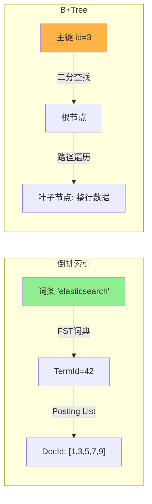
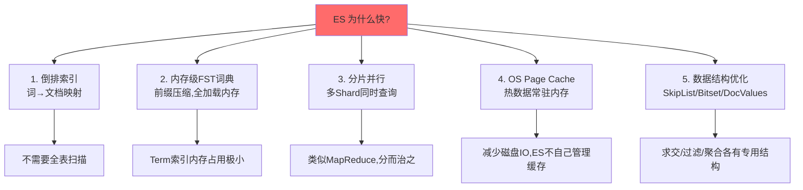
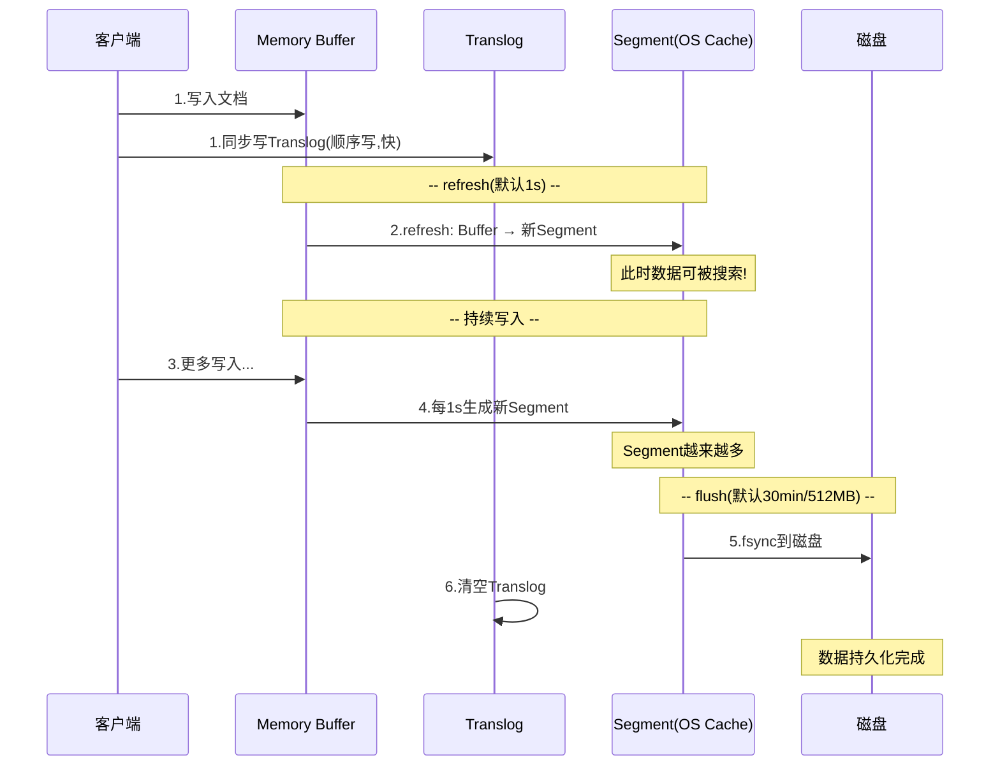
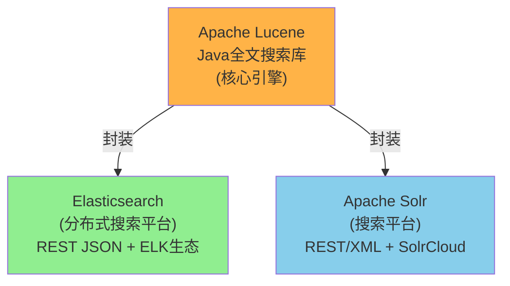
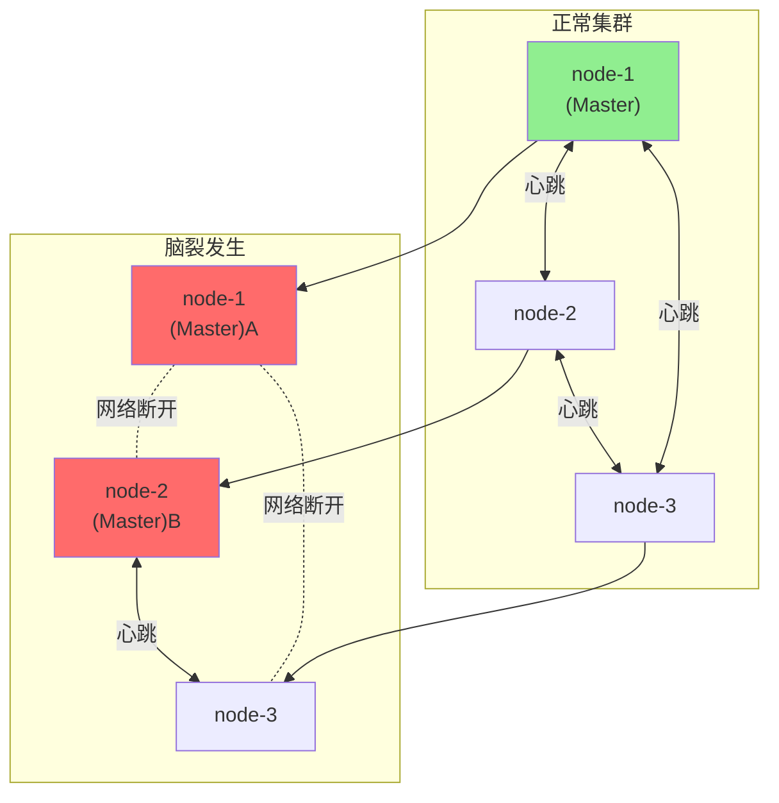
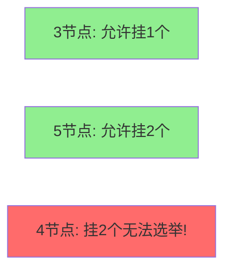

# 03-面试高频问题

## Q1: 倒排索引 vs B+Tree



| 对比维度 | 倒排索引 | B+Tree |
|---------|---------|--------|
| 映射方向 | 词 -> 文档(反向) | 主键 -> 行(正向) |
| 核心场景 | 全文搜索 | 精确查询/范围扫描 |
| 查询方式 | 分词后匹配 | 二分查找 |
| 时间复杂度 | O(1) 词典 + O(n) 合并 | O(logN) |
| 适用系统 | ES/Solr/Lucene | MySQL/PostgreSQL |

**追问: "ES 为什么不用 B+Tree?"**
答: 全文搜索需要"通过词找文档",B+Tree 是为"通过主键找行"设计的。如果为几百万个词每个建一棵 B+Tree,存储和查询都不可行。

## Q2: ES 为什么查询快?



**五层加速叠加**: 不是单一技术,是多个层面的协同效果。每一层各解决一类瓶颈。

## Q3: refresh / flush / translog 写入流程



| 操作 | 频率 | 作用 | 代价 |
|------|------|------|------|
| refresh | 1s | 数据可搜索 | 产生小Segment |
| translog | 每次写入 | 宕机恢复 | 顺序写,开销小 |
| flush | 30min/512MB | 持久化到磁盘 | 重量级IO |
| merge | 后台自动 | 合并小Segment | CPU+IO |

**追问: "写入后多久可搜索?"**
答: 默认 refresh_interval=1s,最快1s。可调小(增加Segment和IO压力)。写入API可加 `?refresh=wait_for` 强制等待。

## Q4: ES vs Solr vs Lucene



| 对比 | Lucene | Solr | ES |
|------|--------|------|-----|
| 定位 | 核心库 | 搜索平台 | 搜索平台 |
| 分布式 | 无 | SolrCloud | 原生集成 |
| API | Java API | REST/XML | REST JSON |
| 实时搜索 | 无 | 较弱 | NRT(1s) |
| 生态 | 无 | 一般 | ELK Stack |
| 社区 | 稳定 | 下降 | 非常活跃 |
| 发布年份 | 1999 | 2004 | 2010 |

**追问: "为什么现在都用 ES?"**
答: 分布式原生、实时性(NRT)、开箱即用的REST API、ELK生态(Kibana可视化、Logstash数据采集、Beats轻量采集器)使得 ES 成为事实标准。

## Q5: ES 集群脑裂(Brain Split)



**脑裂场景**:
1. node-1 网络故障与其他节点断开
2. node-1 自认为还是 Master,继续接受写入
3. node-2+node-3 发现 node-1 失联,选举 node-2 为新 Master
4. 两个 Master 同时存在,各自接受写入 -> 数据不一致

**预防方案**:

| 版本 | 配置 | 说明 |
|------|------|------|
| ES 6.x | `discovery.zen.minimum_master_nodes` | 公式: (eligible_nodes/2)+1 |
| ES 7.x+ | 内置Raft-like算法 | 自动处理,无需手动配置 |
| 通用 | 奇数节点(3或5) | 偶数无法打破平局 |



## ES 知识体系总览

```mermaid
mindmap
  root((ES 核心知识))
    基础原理
      倒排索引
        FST 词典
        FOR/RBM 压缩
        SkipList 求交
      分词器
        Standard Analyzer
        IK 中文分词
        拼音分词
      相关性评分
        TF-IDF
        BM25
    集群架构
      Node 类型
        Master
        Data
        Coordinating
        Ingest
      Shard
        Primary Shard
        Replica Shard
      路由
        hash(routing) % shardCount
      写入流程
        coordinating → primary → replica
    查询体系
      Query DSL
        term / match / range / bool
      搜索两阶段
        Query → Fetch
      聚合
        Bucket / Metrics / Pipeline
      特性
        高亮 / suggest / percolate
    写入流程
      Memory Buffer
      refresh(1s) → Segment
      translog → 宕机恢复
      flush(30min/512MB) → 磁盘
      Segment Merge
    运维
      脑裂
        minimum_master_nodes
      容量规划
        shard 10~50GB
        node ≤ 20 shards
      监控
        _cat API
        _cluster/health
      调优
        堆内存 ≤ 32GB
        关闭 swap
        合理设置 refresh_interval
```