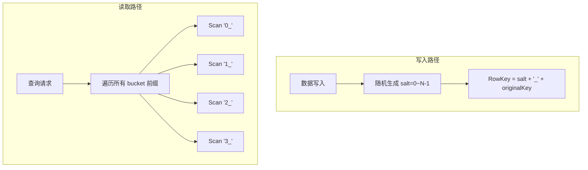
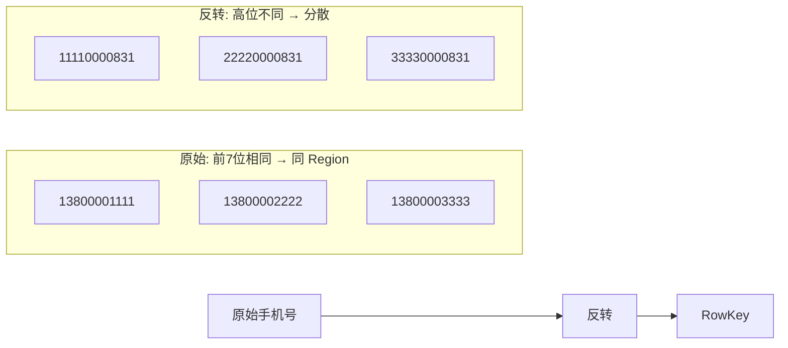
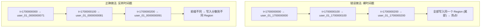
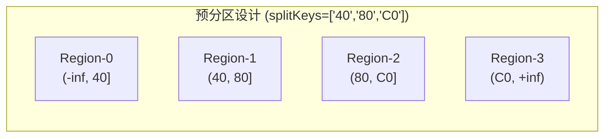

# HBase RowKey 设计核心方案

## 1. 散列法 (MD5 前缀反转)

对原始 RowKey 做 MD5 哈希, 取前 N 个十六进制字符, 反转后拼接到原 RowKey 前面。

### 流程


### 效果对比

| 原始 Key | MD5 前4位 | 反转 | 最终 RowKey |
|----------|-----------|------|-------------|
| user_10001 | c4ca | ac4c | ac4c_user_10001 |
| user_10002 | c81e | e18c | e18c_user_10002 |
| user_10003 | eccb | bcce | bcce_user_10003 |

相邻的 userId 被彻底打散, 写入分散到不同 Region。

---

## 2. 加盐法 (Salt)

在 RowKey 前拼接随机盐值, 将数据分散到 N 个 bucket。



**特点**: 查询放大 N 倍, 适合写多读少场景。

---

## 3. 反转法 (手机号)

将手机号反转后作为 RowKey, 手机号低位变高位, 提高前缀区分度。



---

## 4. 时间戳反转防热点

针对时间序列数据, 反转时间戳避免单调递增带来的 Region 热点。



**两种策略**: 字符串反转 `new StringBuilder(tsStr).reverse()` 或 `Long.MAX_VALUE - timestamp`。

---

## 5. 预分区设计

建表时通过 `splitKeys` 指定 Region 边界, 避免自动 Split。



建表命令:
```
create 'table_name', 'cf', SPLITS => ['40', '80', 'C0']
```

---

## RowKey 设计 5 大原则总结

| 原则 | 方法 | 原因 |
|------|------|------|
| 长度原则 | 50~100 字节 | RowKey 存储于每个 KeyValue, 过长增大 IO |
| 散列原则 | MD5/加盐/反转 | 均匀分布到各 Region, 避免热点 |
| 唯一原则 | RowKey 即主键 | 同一 RowKey 覆盖写 |
| 排序原则 | 字典序存储 | 高频查询条件放 RowKey 高位, 高效 Scan |
| 防单调递增 | 时间戳反转/加盐 | 防止写入集中在最后一个 Region |