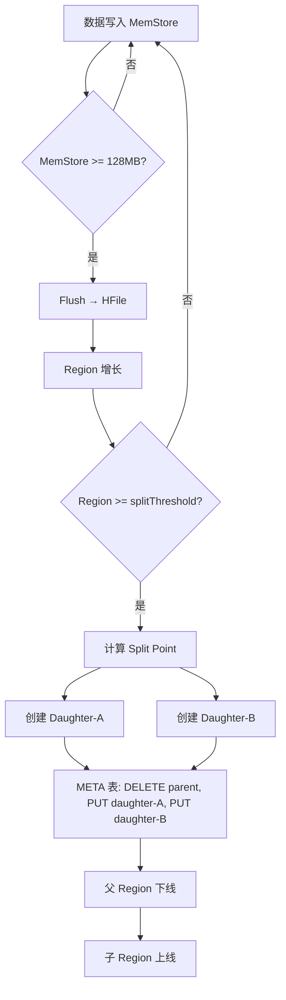
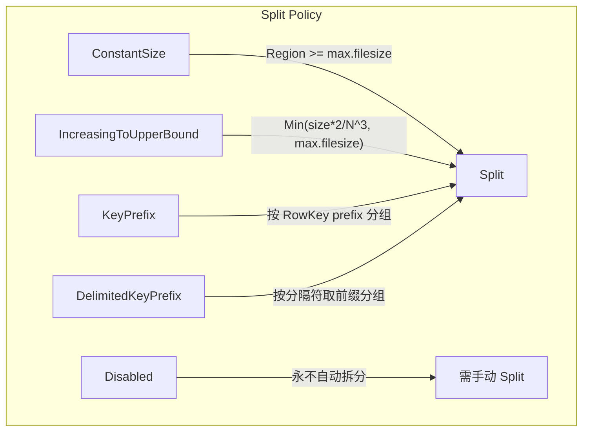
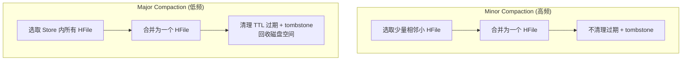
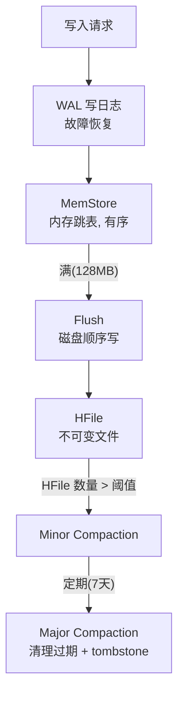

# HBase Region 拆分与 Compaction

## 1. Region Split 全流程

Region 拆分完整链路: 写入 MemStore -> Flush 生成 HFile -> Region 大小超阈值 -> 计算 Split Point -> 创建 Daughter Regions -> 更新 META 表。

---

## 2. MemStore Flush 触发条件

| 触发级别 | 条件 | 说明 |
|----------|------|------|
| Region 级 | MemStore >= 128MB (flush.size) | 单个 Region 的 Store 的 MemStore 达到阈值 |
| RS 全局 | 全局 MemStore >= 堆 * 40% | 大到小依次 Flush, 直到低于 lowerLimit(95%) |
| WAL 上限 | WAL 文件数 > maxlogs(默认32) | Flush 最早的 MemStore 以清理 WAL |
| 手动触发 | flush 'table_name' | Shell/API 手动执行 |
| Region 关闭 | Split/Balance 前 | 下线前强制 Flush |

---

## 3. Split Policy 策略对比

### IncreasingToUpperBound (默认策略)

| Region 数 | 拆分阈值 (TB) |
|-----------|--------------|
| 1 | 1 |
| 2 | 2 |
| 4 | 4 |
| 8 | 6.4 |
| 16+ | max.filesize (10GB 默认) |

防止大表产生过多小 Region。

---

## 4. 拆分期间读写一致性 (HBase 2.0+ Procedure V2)

- **读一致性**: 拆分期间读仍路由到父 Region。Client 缓存过期 -> NotServingRegionException -> 重试 META 定位
- **写一致性**: 父 Region close -> 子 Region open 短暂写阻塞 (毫秒级)。WAL 保证数据不丢

---

## 5. Compaction 机制

### Minor vs Major Compaction

### 对比表

| 类型 | 频率 | 开销 | 清理删除标记 | 适用时机 |
|------|------|------|-------------|---------|
| Minor | 高频 (秒~分钟) | 低 | 否 | 持续后台运行 |
| Major | 低频 (天~周, 默认7天) | 高 | 是 | 低峰期手动触发 |

### Compaction IO 优化

- **Throttling**: 限速, 避免影响在线读写
- **Stripe Compaction** (HBase 2.0+): 按 RowKey 范围分组合并, 减少单次开销
- **Date Tiered Compaction**: 按时序分层合并, 适合时间序列数据

---

## 6. LSM-Tree 写入模型

**写入快**: 顺序写磁盘 (WAL + HFile), 内存跳表结构
**读需优化**: 数据分散在 MemStore + 多 HFile -> BloomFilter + BlockCache