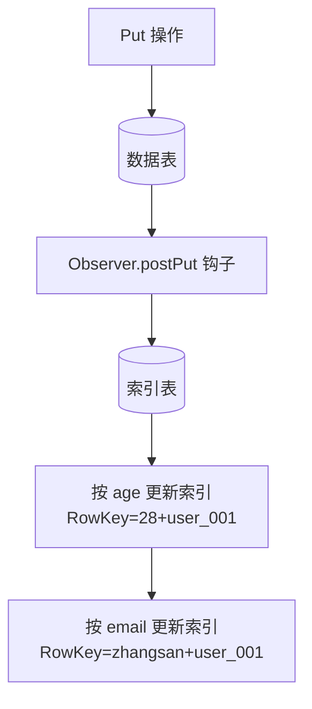
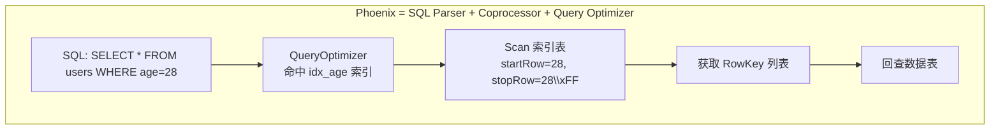
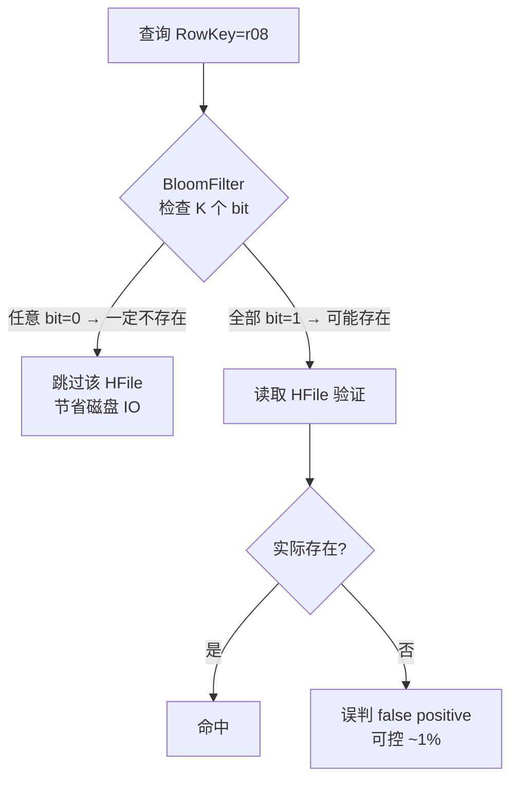

# HBase 二级索引与面试高频问答

## 1. 二级索引三种方案

### 全局索引 (独立索引表)

```mermaid
graph TB
    W[数据写入] --> DT[(数据表<br/>RowKey→UserInfo)]
    W --> IT[(索引表<br/>age→RowKey)]
    Q[查询 age=28] --> IT
    IT --> |"获取 RowKey 列表"| RK[["user_001","user_004"]]
    RK --> DT
    DT --> R[返回完整数据]
```

- 索引表独立, RowKey = 索引列 + 原 RowKey
- **写入**: 需保证双表一致性 (分布式事务/最终一致)
- **查询**: 先查索引表 (1 次 Scan), 再查数据表 (N 次 Get)
- **优点**: 索引独立, 查询只需扫描索引 Region
- **缺点**: 二次查询 (回表), 网络开销

### 本地索引 (索引与数据共存)

```mermaid
graph TB
    subgraph "Region-1"
        D1[RowKey: user_001<br/>data:{name=张三}<br/>index:{age=28}]
        D2[RowKey: user_002<br/>data:{name=李四}<br/>index:{age=32}]
    end
    subgraph "Region-2"
        D3[RowKey: user_004<br/>data:{name=赵六}<br/>index:{age=28}]
    end
    Q[查询 age=28] --> |"Scan Region-1"| D1
    Q --> |"Scan Region-2"| D3
```

- 索引与数据在同一行 (同一 Region)
- **写入**: 单行原子操作, 无需分布式事务
- **查询**: 需要 Scan 所有 Region (放大)
- **优点**: 写入原子, 无分布式事务开销
- **缺点**: 查询需扫描全部 Region, 数据量大时性能差

### 协处理器 Observer (Phoenix 方案)



- 注册 RegionObserver, postPut 自动同步索引
- Phoenix 本质: SQL Parser + 协处理器框架 + 查询优化器

### 方案对比

| 方案 | 写入一致性 | 查询效率 | 适用场景 |
|------|-----------|---------|---------|
| 全局索引 | 需分布式事务 | 高 (O(1)+1 次回表) | 读多写少 |
| 本地索引 | 单行原子 | 中 (O(N), Scan 全表) | 写多读少, 数据量小 |
| 协处理器 | 最终一致 | 高 (自动同步) | Phoenix 生产级方案 |

---

## 2. Phoenix 协处理器框架概念



### 建索引流程

1. `CREATE INDEX idx_age ON users(age)`
2. Phoenix 自动创建索引表: USERS_IDX_AGE (RowKey = age + 原 RowKey)
3. 注册 Indexer RegionObserver 到 USERS 表的所有 Region

### Phoenix 索引类型

| 类型 | 特点 |
|------|------|
| GLOBAL (全局索引) | 索引表独立, 读快写慢 (跨 RegionServer 写) |
| LOCAL (本地索引) | 索引与数据同 Region, 写快读慢 (扫描所有 Region) |
| COVERED (覆盖索引) | 索引包含查询所需全部列, 无需回表 |

### 协处理器能力总结

| 接口 | 作用 |
|------|------|
| RegionObserver | 拦截 get/put/scan/delete, 实现索引同步/权限校验/审计 |
| MasterObserver | 拦截 DDL, 实现表创建校验/自动化管理 |
| Endpoint | 服务端计算, COUNT/SUM/AVG 聚合, 避免数据大量传输 |
| CoprocessorEnvironment | 提供 Region/Master 上下文, 可访问 HBase 内部 API |

---

## 3. BloomFilter 行级过滤



### BloomFilter 类型

| 类型 | 粒度 | 说明 |
|------|------|------|
| ROW | RowKey | 默认, 每个 HFile 的 RowKey 布隆过滤 |
| ROWCOL | RowKey + ColumnFamily + Qualifier | 更精确, 查特定列时跳过不含该列的行 |

配置: `create 'table', {NAME => 'cf', BLOOMFILTER => 'ROWCOL'}`

---

## 4. 面试高频问答

### Q1: RowKey 设计的 5 大原则?

1. **长度原则**: 50~100 字节, 过长增大 IO/存储
2. **散列原则**: MD5/加盐/反转打散, 避免热点 Region
3. **唯一原则**: RowKey 即主键, 同一 RowKey 覆盖写
4. **排序原则**: 字典序存储, 高频查询条件放高位
5. **防单调递增**: 时间戳反转/Long.MAX_VALUE - ts

### Q2: MemStore Flush 触发条件?

| 级别 | 条件 |
|------|------|
| Region | MemStore >= 128MB |
| RS 全局 | 全局 MemStore >= 堆 * 40% |
| WAL 上限 | WAL 数量 > maxlogs(32) |
| 手动 | flush 'table_name' |
| Region 下线 | Split/Balance 前 |

### Q3: Minor vs Major Compaction?

- **Minor**: 高频, 合并少量相邻小 HFile, 不清理 tombstone
- **Major**: 低频 (7 天), 合并全部 HFile, 清理 TTL 过期 + tombstone, 开销大

### Q4: HBase vs MySQL vs ES?

| 特性 | HBase | MySQL (InnoDB) | ES |
|------|-------|---------------|-----|
| 存储引擎 | LSM-Tree | B+Tree | 倒排索引 |
| 扩展性 | 水平扩展 (强) | 垂直为主 | 水平扩展 (强) |
| 查询 | RowKey Scan | SQL 全部 | 全文搜索+聚合 |
| 事务 | 单行原子 | ACID | 不支持 |
| 写性能 | 极高 (顺序写) | 中 (随机写) | 中 (近实时 1s) |
| 数据量级 | TB~PB | GB~TB | TB~PB |
| 适用 | 海量写入/时序 | OLTP 业务 | 全文搜索/日志 |