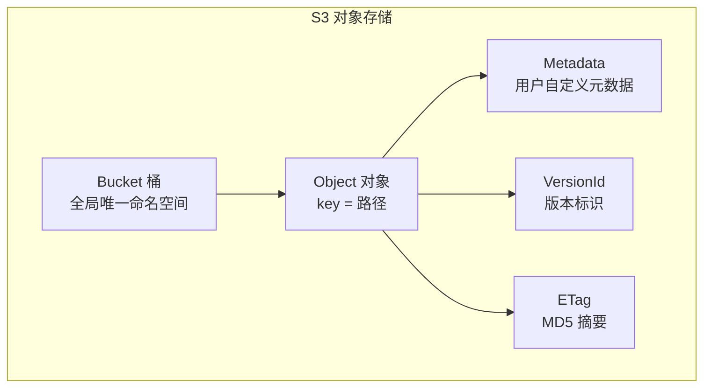
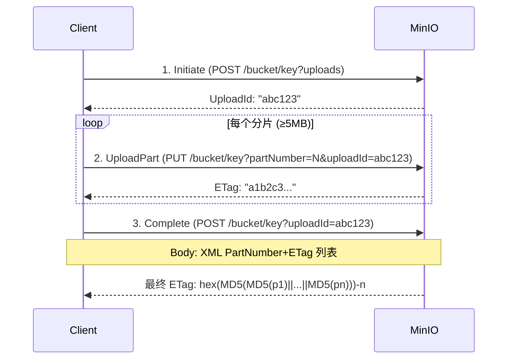
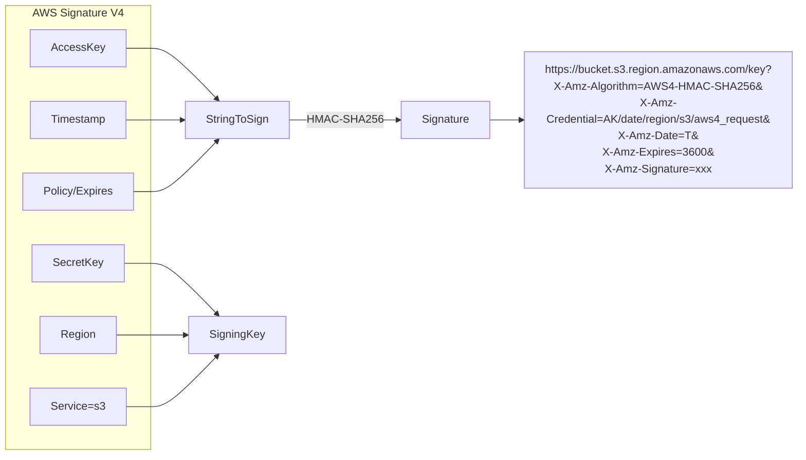

# MinIO 对象存储与 S3 API

## 1. S3 对象存储模型

MinIO 完全兼容 AWS S3 API，核心概念如下：



### 核心概念

| 概念 | 说明 |
|------|------|
| **Bucket** | 桶，对象容器，全局命名空间唯一，名称 3~63 字符 |
| **Object** | 对象，由 key(路径) + data(二进制) + metadata(kv) + ETag 组成 |
| **ETag** | 实体标签，MD5(数据)。Multipart Upload 时为组合 ETag |
| **VersionId** | 版本 ID，开启版本控制后每次写入生成唯一 ID |
| **Metadata** | 用户自定义元数据，以 `x-amz-meta-` 为前缀 |

---

## 2. S3 API 操作 (CRUD)

### Bucket 操作

| 操作 | HTTP | 说明 |
|------|------|------|
| CreateBucket | PUT /bucket | 创建桶，指定 Region |
| ListBuckets | GET / | 列出所有桶 |
| DeleteBucket | DELETE /bucket | 删除空桶 |
| HeadBucket | HEAD /bucket | 检查桶是否存在 |

### Object 操作

| 操作 | HTTP | 说明 |
|------|------|------|
| PutObject | PUT /bucket/key | 上传对象 (最大 5GB) |
| GetObject | GET /bucket/key | 下载对象 |
| HeadObject | HEAD /bucket/key | 获取对象元数据 (不含数据) |
| DeleteObject | DELETE /bucket/key | 删除对象 |
| CopyObject | PUT /bucket/dest?x-amz-copy-source=/src | 复制对象 |
| ListObjects | GET /bucket?prefix=xxx | 列出对象 (最大 1000/次) |

---

## 3. Multipart Upload 分片上传

大文件通过分片并行上传，三步骤：



### 关键参数

| 参数 | 值 |
|------|-----|
| 最小分片 | 5MB (除最后一片) |
| 最大分片 | 5GB |
| 最多分片 | 10,000 |
| 单对象上限 | 5TB |
| 并行上传 | 支持，建议 3~5 片并发 |

### Multipart ETag 计算

```
最终 ETag = hex(MD5(concat(MD5(part1), MD5(part2), ..., MD5(partN)))) + "-" + N
```

示例：上传 3 片后，ETag 为 `8cf16deab8a7b-3`

---

## 4. Pre-signed URL 预签名

为私有对象生成临时的公开访问链接。

### 签名流程



### URL 参数

| 参数 | 说明 |
|------|------|
| X-Amz-Algorithm | 签名算法: AWS4-HMAC-SHA256 |
| X-Amz-Credential | 凭证: AK/date/region/s3/aws4_request |
| X-Amz-Date | 签名时间戳 |
| X-Amz-Expires | 有效期 (秒)，最长 7 天 |
| X-Amz-Signature | 签名值 |

---

## 5. 对象元数据 (Metadata)

### 系统元数据 (自动生成)

| 字段 | 说明 |
|------|------|
| Content-Length | 对象大小 (bytes) |
| Content-Type | MIME 类型 |
| ETag | 实体标签 (MD5) |
| Last-Modified | 最后修改时间 |
| x-amz-version-id | 版本 ID |

### 用户自定义元数据

上传时通过 HTTP Header 传入，以 `x-amz-meta-` 为前缀：

```
PUT /bucket/photo.jpg
x-amz-meta-owner: zhangsan
x-amz-meta-category: profile
x-amz-meta-upload-date: 2024-01-15
```

GET 时通过相同 Header 返回。