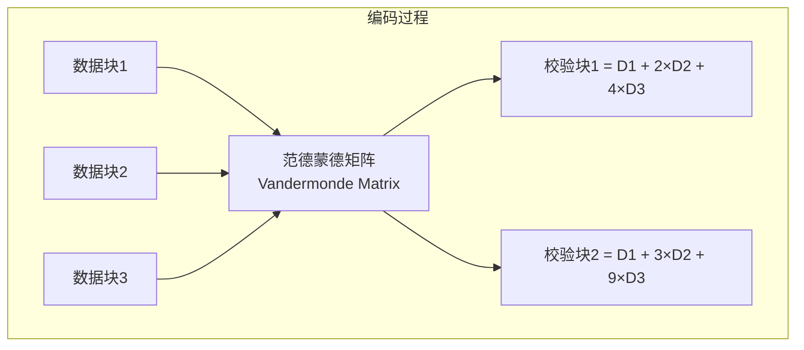
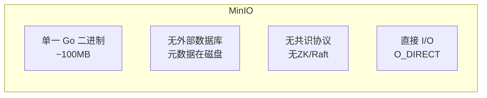
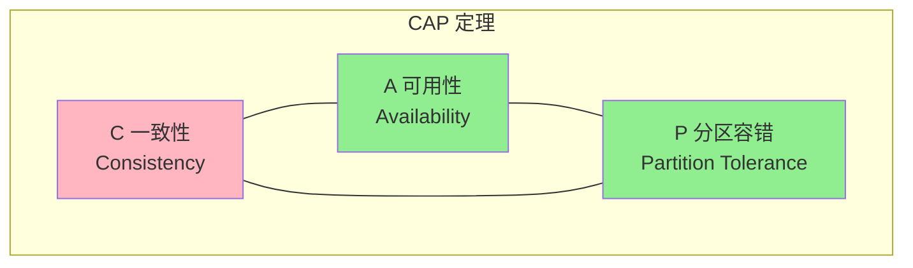
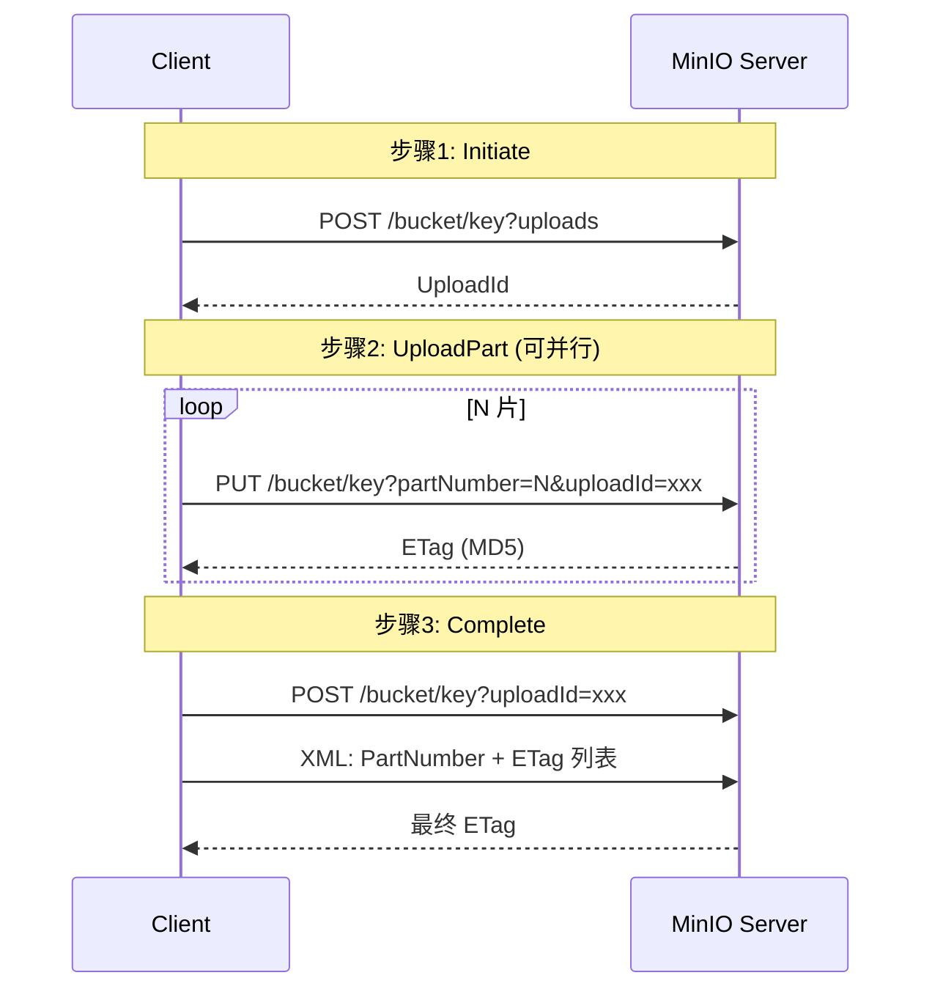
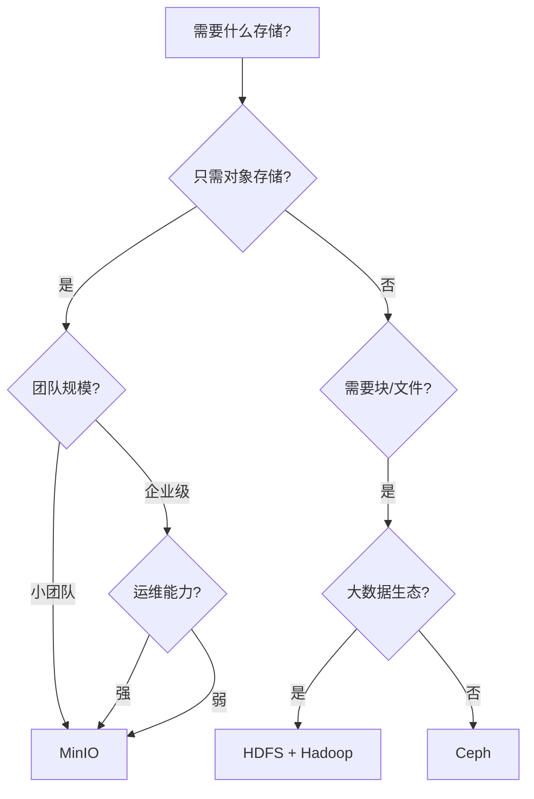

# MinIO 面试高频问题

## 1. EC 纠删码 vs 多副本

### 存储开销计算公式

```
存储空间 = 原始大小 × (k + m) / k
```

**示例：1TB 原始数据**

| 方案 | 存储占用 | 开销比 | 容错数 | 适用场景 |
|------|---------|--------|--------|---------|
| 3 副本 | 3 TB | 300% | 2 | 简单可靠，无需计算 |
| RS(4+2) | 1.5 TB | 150% | 2 | 小规模集群 |
| RS(8+4) | 1.5 TB | 150% | 4 | MinIO 默认，生产推荐 |
| RS(12+4) | 1.33 TB | 133% | 4 | 更大集群，更高效率 |

### Reed-Solomon 编码原理 (简化)



缺失任意 ≤m 个块 (数据+校验混合) 均可通过高斯消元恢复。

### EC 写入流程

```
1. 数据分块: 原始数据 → K 个数据块
2. RS 编码: K 数据块 → M 个校验块
3. 分片分发: K+M 块分散到不同磁盘/节点
4. 元数据: 记录分片分布 + 编码参数 (k, m, 块大小)
```

### EC 读取恢复流程

```
正常路径: 读取 K 个数据块 → 直接返回 (无 CPU 开销)
故障路径: 数据块不足 K → 用校验块参与解码 → 高斯消元恢复
```

---

## 2. MinIO 为何轻量？



| 维度 | MinIO | HDFS |
|------|-------|------|
| 语言 | Go (编译为单一二进制) | Java (需要 JVM) |
| 部署 | 单文件，一条命令 | 多组件 (NN+DN+ZK+JN) |
| 启动时间 | < 1 秒 | 30 秒 ~ 数分钟 |
| 元数据 | 与数据共存磁盘 | NameNode 内存 (瓶颈) |
| SPOF | 无 | NameNode (需要 HA) |
| 内存占用 | 低 | NameNode 需大堆 (GB 级) |

### 关键设计

1. **Go 语言**：编译为原生二进制，无 JVM/解释器依赖
2. **无外部依赖**：不需要数据库、ZooKeeper、消息队列
3. **元数据与数据共存**：每个磁盘上的 `.minio.sys/` 目录存储元数据
4. **直接 I/O**：绕过操作系统文件缓存 (O_DIRECT)，减少内存拷贝
5. **无中心节点**：所有节点平等，无 NameNode 瓶颈

---

## 3. S3 最终一致性

### CAP 定理视角



S3 最初选择 **AP** (可用性 + 分区容错)，牺牲强一致性。

### 为什么之前是最终一致性？

- **分布式写入**：数据先写入多个节点，同步存在延迟
- **无事务协调**：不像 RDBMS，S3 无分布式事务保证
- **全球部署**：跨区域复制，延迟不可避免

### 2020 年后变化

AWS S3 对所有 PUT/GET 操作默认**强一致性**：

- 内部使用 Paxos-like 共识协议
- 原子性元数据更新
- 对用户透明，无需修改代码

MinIO 默认强一致性（单节点或复制集内）。

---

## 4. Multipart Upload 原理

### 三步骤



### 优势

| 优势 | 说明 |
|------|------|
| 并行上传 | 多片同时传输，充分利用带宽 |
| 断点续传 | 某片失败只需重传该片 |
| 未知大小 | 可在不知道总大小的情况下开始上传 |
| 暂停/恢复 | 可列出未完成的 UploadId 并恢复 |
| 吞吐优化 | 每片独立 TCP 连接，避免单连接瓶颈 |

### 注意事项

- 除最后一片外，每片 >= 5MB
- 最多 10,000 片，建议 3~5 片并发
- 未完成的 Multipart Upload 会占用存储，需要定期清理 (Abort)
- 可设置生命周期规则自动清除超过 N 天的未完成上传

---

## 5. MinIO vs Ceph vs HDFS

### 对比总表

| 维度 | MinIO | Ceph | HDFS |
|------|-------|------|------|
| 类型 | 对象存储 (S3) | 统一存储 (对象/块/文件) | 分布式文件系统 |
| 语言 | Go | C++ | Java |
| 元数据管理 | 分布式 (与数据共存) | MON + OSD | NameNode (单点/HA) |
| 数据保护 | EC (Reed-Solomon) | EC + 多副本 | 多副本 (默认 3) |
| 最小节点数 | 1 | 3 (MON + OSD) | 2 (NN + DN) |
| 部署复杂度 | 低 | 高 | 中 |
| 性能 | 高 (直接 I/O) | 中高 | 高 (顺序读写) |
| 运维难度 | 低 | 高 | 中 |
| 适用场景 | 云原生, K8s, AI/ML | 大型私有云, OpenStack | 大数据 (Spark/Hive) |

### 选型建议



- **MinIO**：云原生、K8s 部署、AI/ML 数据湖、备份归档
- **Ceph**：大型私有云、OpenStack 底层、需要统一存储的场景
- **HDFS**：Hadoop/Spark 大数据分析、批处理、数据仓库

---

## 常见追问

### Q: MinIO 单机模式有意义吗？

有。单机模式用于开发测试、边缘计算、单节点备份，也可搭配 RAID 保护数据。MinIO 单机也可通过多磁盘实现 EC。

### Q: MinIO 如何保证数据一致性？

- **单节点**：文件系统原子操作保证
- **多节点**：MinIO 使用严格的 quorum 写入 (write quorum = N/2+1)
- **校验**：每个对象写入后立即校验 MD5

### Q: MinIO 如何扩容？

- MinIO 支持**在线扩容**，通过添加新的 Server Pool
- 新数据会自动分布到新 Pool
- 旧数据不会自动迁移 (需要手动或等待自然过期)