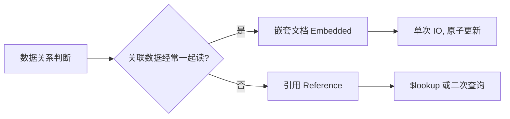

# MongoDB 文档模型核心原理

> 对应源码: [DocumentModelDemo.java](../../../java/base/mongodb/DocumentModelDemo.java)

---

## 一、BSON vs JSON

| 维度 | JSON | BSON |
|------|------|------|
| 编码 | 文本 (UTF-8) | 二进制 |
| 可读性 | 人类可读 | 机器解析 |
| 类型支持 | String/Number/Boolean/Null/Array/Object | 额外支持 Date/Binary/ObjectId/Decimal128/Timestamp |
| 遍历速度 | O(n) 逐字符解析 | 长度前缀快速跳过 |
| 存储 | 无类型标记 | 每个字段有类型标记 (1 字节) |
| 空间 | 较小 (文本) | 略大 (含元数据) |

**BSON 编码规则**:
- 文档开头 4 字节总长度
- 每个字段: `[类型1B][键名\0][值]`
- 文档以 `\x00` 结尾
- 支持嵌套文档和数组

---

## 二、嵌套文档 vs 引用



| 维度 | 嵌套 (Embedded) | 引用 (Reference) |
|------|-----------------|-----------------|
| 数据量 | 子文档 < 100 条 | 无限制 |
| 读取 | 1 次 IO | 2 次 IO 或 $lookup |
| 更新 | 原子性 (单文档) | 需事务保证 |
| 独立查询 | 不支持 | 支持 |

**金句**: 一起读的放一起 (嵌入)，经常变的独立存 (引用)。

---

## 三、集合等价关系

| RDBMS | MongoDB |
|-------|---------|
| Database | Database |
| Table | Collection |
| Row | Document (BSON) |
| Column | Field |
| Primary Key (_id) | _id (默认 ObjectId) |
| Index | Index |
| JOIN | $lookup |
| GROUP BY | $group |

---

## 四、ObjectId 12 字节

```
┌────────────┬──────────────────┬──────────────┐
│  4 字节    │     5 字节       │   3 字节     │
│ timestamp  │  random value    │   counter    │
│ (Unix秒)   │ (MongoDB 5.0+    │  (自增计数器)│
│            │  改为纯随机值)   │              │
└────────────┴──────────────────┴──────────────┘
```

**历史结构 (3.2 之前)**:
- 4B timestamp + 3B MAC + 2B PID + 3B counter
- MongoDB 5.0+ 将 5B 改为纯随机值 (安全: 不暴露机器信息)

**优势**:
1. 时间戳在前 -> 天然按创建时间排序
2. 客户端生成 -> 无需中心化 ID 生成器
3. 12 字节 -> 比 UUID (36 字符) 小很多

---

## 五、关键设计原则

1. **数据随查询而聚合**: 根据业务查询模式设计文档结构，而非按照范式
2. **文档大小限制**: 单文档最大 16MB，大对象用 GridFS
3. **原子操作边界**: 单文档操作是原子的，跨文档需要多文档事务 (4.0+)
4. **避免过度规范化**: MongoDB 不是关系型数据库，嵌套优于 JOIN