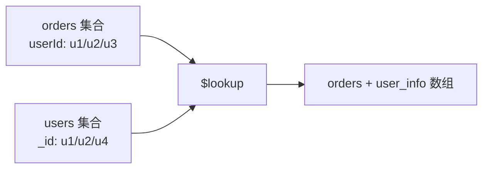

# MongoDB 聚合管道 (Aggregation Pipeline)

> 对应源码: [AggregationPipelineDemo.java](../../../java/base/mongodb/AggregationPipelineDemo.java)

---

## 一、Pipeline 流程


每个 Stage 接收上一 Stage 的输出文档列表，处理后传给下一 Stage。

---

## 二、各 Stage 作用

| Stage | 作用 | SQL 类比 |
|-------|------|----------|
| `$match` | 过滤文档 | WHERE |
| `$group` | 分组聚合 (sum/avg/count/min/max) | GROUP BY |
| `$sort` | 排序 (1 升序, -1 降序) | ORDER BY |
| `$project` | 字段投影 (选择/重命名/计算) | SELECT |
| `$limit` | 限制返回条数 | LIMIT |
| `$skip` | 跳过前 N 条 | OFFSET |
| `$lookup` | 左外连接另一集合 | LEFT JOIN |
| `$unwind` | 展开数组为多条文档 | -- |
| `$addFields` | 添加计算字段 | -- |
| `$bucket` | 分桶聚合 | CASE WHEN |

---

## 三、$lookup 详解



**语法**:
```javascript
db.orders.aggregate([
  {
    $lookup: {
      from: "users",         // 被关联集合
      localField: "userId",  // 本集合关联字段
      foreignField: "_id",   // 目标集合关联字段
      as: "user_info"        // 结果字段名
    }
  }
])
```

**注意事项**:
- `$lookup` 是左外连接 (不匹配则返回空数组)
- 对大集合做 `$lookup` 需确保 foreignField 上有索引
- 高频 `$lookup` 场景建议改用嵌套文档设计

---

## 四、Pipeline 优化

1. **$match 前置**: 尽量将 `$match` 放在 pipeline 最前，减少后续 stage 数据量
2. **$sort 紧跟 $match**: 利用索引排序，避免内存排序 (内存限制 100MB)
3. **$project 精简**: 尽早投影需要的字段，减少文档大小
4. **$lookup 索引**: foreignField 必须有索引
5. **allowDiskUse**: 数据量大时启用磁盘临时存储

---

## 五、索引与 Pipeline 配合

| Pipeline Stage | 可使用的索引 |
|---------------|-------------|
| `$match` | 单字段/复合/文本/地理空间索引 |
| `$sort` | 复合索引 (ESR 规则: Equality -> Sort -> Range) |
| `$lookup` | foreignField 上的索引 |