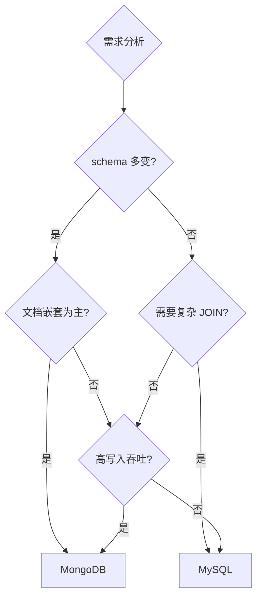
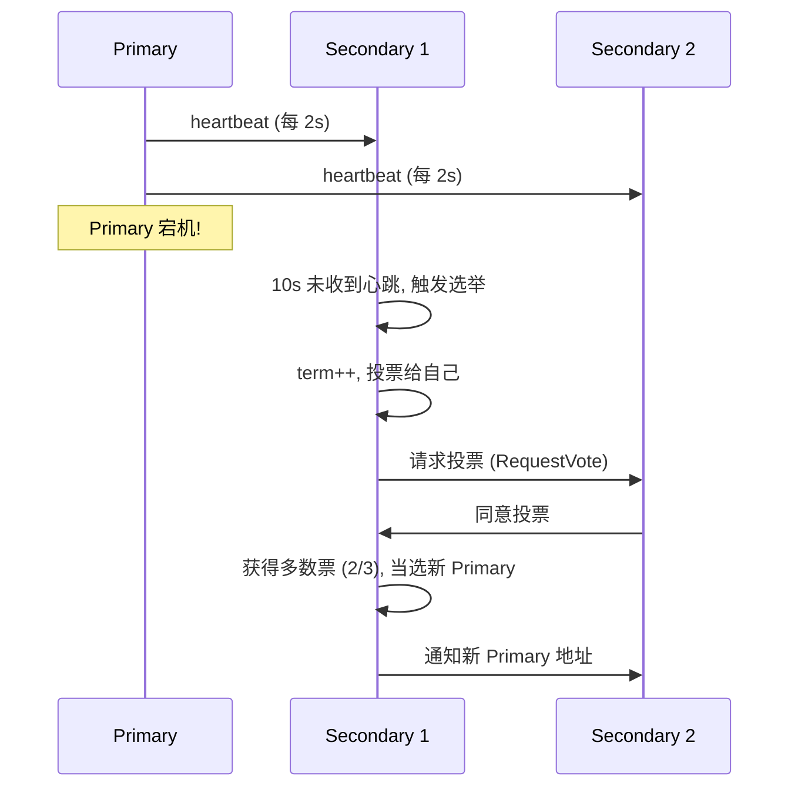

# MongoDB 高频面试题

> 对应源码: [Q01_MongoDB_Design.java](../../../java/base/mongodb/interview/Q01_MongoDB_Design.java)

---

## Q1: 嵌入 vs 引用如何选择?

**嵌入 (Embedded)**: 子文档直接嵌套在父文档中
- 适用: 一对一/一对少量 (用户-地址、订单-订单项)
- 优势: 单次 IO、原子更新
- 限制: 16MB 上限、子文档无法独立查询

**引用 (Reference)**: 仅存储关联 ID
- 适用: 一对多/多对多 (文章-评论、商品-分类)
- 优势: 数据独立、易更新
- 劣势: 多次 IO 或需要 `$lookup`

**决策**: 一起读的放一起 (嵌入)，经常变的独立存 (引用)

---

## Q2: ObjectId vs UUID 如何选择?

| 维度 | ObjectId | UUID |
|------|----------|------|
| 大小 | 12 字节 | 36 字符 |
| 排序 | 天然时间排序 | 随机 (索引不友好) |
| 安全性 | 暴露创建时间 | 无信息泄露 |
| 推荐 | 默认 _id | 对外 API 返回 |

**最佳实践**: 内部用 ObjectId 做 _id，对外 API 暴露 UUID/ULID。

---

## Q3: MongoDB vs MySQL 如何选型?

| 场景 | 推荐 |
|------|------|
| 内容管理/CMS | MongoDB (灵活 schema) |
| 金融交易 | MySQL (ACID 强事务) |
| 日志/埋点 | MongoDB (高写入吞吐) |
| 报表分析 | MySQL (SQL 成熟) |
| IoT 时序数据 | MongoDB (文档+时序集合) |

---

## Q4: 副本集选举过程

**关键参数**:
- `priority`: 0-1000，越大越容易当选 (0 = 不参选)
- `heartbeatIntervalMillis`: 心跳间隔，默认 2000ms
- `electionTimeoutMillis`: 选举超时，默认 10000ms

---

## Q5: 3 种一致性级别

### writeConcern (写关注)
| 值 | 含义 |
|----|------|
| `{w: 0}` | 不确认，最快但可能丢数据 |
| `{w: 1}` | Primary 确认即返回 (默认) |
| `{w: "majority"}` | 多数节点确认才返回 (推荐) |
| `{w: "majority", j: true}` | 多数节点 journal 持久化 (最安全) |

### readConcern (读关注)
| 值 | 含义 |
|----|------|
| `"local"` | 读节点最新数据 (默认，可能未提交) |
| `"majority"` | 只读已多数确认的数据 (安全，不回滚) |
| `"linearizable"` | 线性一致 (验证 Primary 仍是 Primary) |

### readPreference (读偏好)
| 值 | 含义 |
|----|------|
| `"primary"` | 只读 Primary (默认，强一致) |
| `"secondary"` | 只读 Secondary (分担压力，可能滞后) |
| `"nearest"` | 读延迟最低节点 |

### 推荐组合

| 场景 | writeConcern | readConcern | readPreference |
|------|-------------|-------------|----------------|
| 金融/交易 | majority | majority | primary |
| 日志/埋点 | 1 | local | secondary |
| 通用业务 | majority | local | primary |

---

## 附: MongoDB 索引类型速查

| 类型 | 创建 | 适用 |
|------|------|------|
| 单字段 | `{field: 1}` | 简单等值/范围查询 |
| 复合 | `{a:1, b:1}` | 多条件查询，ESR 规则 |
| 多键 | `{tags: 1}` | 数组字段查询 |
| 文本 | `{content: "text"}` | 全文搜索 |
| TTL | `{createdAt: 1}, {expireAfterSeconds: 3600}` | 自动过期 |
| 地理空间 | `{location: "2dsphere"}` | 附近搜索 |
| 哈希 | `{field: "hashed"}` | 分片 shard key |
| 唯一 | `{field: 1}, {unique: true}` | 去重字段 |
| 稀疏 | `{field: 1}, {sparse: true}` | 只索引存在该字段的文档 |